# FYP Phase-II Full Project Context

> Machine-generated context file. Purpose: give another AI assistant
> everything it needs to fill the "FYP Phase-II Documentation" template
> **without inventing anything**. Every claim below is extracted from the
> repository at `C:\Users\LENOVO\Downloads\ai_ids_completeclaude\ai_ids_complete`.
> Generated 2026-05-29.

---

## 0. Evidence Rules Used

- **Everything here is extracted from the repository only** — source code,
  config files, JSON artifacts, the trained-model metadata, the SQLite
  schema DDL, the in-repo Markdown docs, and the test suite. File paths are
  cited as evidence throughout.
- Where the repository's own prose docs (e.g. `CURRENT_STATE.md`,
  `RECONCILIATION_PHASE2.md`, `defense/QA_BANK.md`) **disagree with the actual
  code**, this file reports **what the code does** and flags the drift. These
  are called out under **DOC-DRIFT** notes so the documentation writer does
  not propagate stale claims.
- Status markers used:
  - **IMPLEMENTED** — present and working in code.
  - **PARTIALLY IMPLEMENTED** — present but incomplete or with caveats.
  - **PLANNED / NOT IMPLEMENTED** — described in `FUTURE_WORK.md` or docs as
    future work; no working code.
  - **NOT FOUND IN REPOSITORY** — searched for, not present.
- **No metric, accuracy, test result, dataset, diagram, or feature was
  invented.** All ML metrics are quoted verbatim from
  `models/model_meta.json` and `evaluation/metrics.json` /
  `evaluation/evaluation_report.txt`. All live-attack numbers are quoted from
  `lab/ATTACK_VALIDATION.md` and `lab/attack_log.csv`.

### Key DOC-DRIFT findings (read these first)

1. **Native desktop window is NEW and undocumented in CHANGES.md.** As of
   2026-05-29 the project added a `pywebview` desktop wrapper
   (`desktop_app.py`, `assets/` icons, `pywebview==6.2.1` in
   `env/requirements.txt`, `launch.py` spawns it). The latest `CHANGES.md`
   entry is dated 2026-05-28, so this change is **not yet logged**. This
   materially affects the "desktop vs web GUI" discussion (see §22, §5).
2. **CORS is pinned, not open.** `src/serve/app.py:214-219` pins
   `allow_origins=["http://localhost:8501","http://127.0.0.1:8501"]`.
   `CURRENT_STATE.md` still says `allow_origins=["*"]` — that is **stale**.
3. **Filename drift in prose docs.** Several docs reference files that do not
   exist under those names. Actual vs referenced:
   - `src/auth/tokens.py` is the real session/token module. Docs
     (`RECONCILIATION_PHASE2.md`, `QA_BANK.md`) call it `src/auth/sessions.py`
     — **that file does not exist**.
   - Binary/multi models load as `rf_cic_binary.joblib` /
     `rf_cic_multi.joblib` (with fallbacks `rf_binary.joblib`, `rf.joblib`,
     `rf_multi.joblib`). Docs reference `models/rf_multiclass.joblib` — **that
     file does not exist**.
   - There is **no `src/models/inference.py`**. Inference is performed inline
     in `src/serve/app.py` (`predict()`), not a separate module as
     `RECONCILIATION_PHASE2.md` §3/UC_03 implies.
   - There is **no `src/auth/dependencies.py`**. The
     `require_permission(...)` dependency lives in `src/auth/rbac.py`.
4. **`models/threshold.txt` is present and non-empty** — it contains
   `0.385841`. (A directory listing rounds its size to 0 KB; the file has
   content.)

---

## 1. Project Identity

| Field | Value | Evidence |
|---|---|---|
| **Full title** | AI-Driven Intrusion Detection and Threat Mitigation System for Secure Networks | `README.md:1`, `CLAUDE.md`, `CURRENT_STATE.md:13` |
| **Short name** | AI-IDS | `README.md`, `src/serve/app.py` (`title="AI-IDS Detection API"`), dashboard title "AI-IDS · SOC Console" |
| **Domain / area** | Cybersecurity / Artificial Intelligence (Network Intrusion Detection) | `README.md`, user brief |
| **Keywords** | Intrusion Detection, Machine Learning, Network Security, Real-Time Monitoring, Cybersecurity | user brief (not enumerated in repo, but supported by content) |
| **Supervisor** | Dr. Nadeem Iqbal, Department of CS & IT | `README.md:5`, `CURRENT_STATE.md:16`, `CLAUDE.md` |
| **Group member 1** | Muhammad Mousa Khan — SAP ID 70140245 — 70140245@student.uol.edu.pk | `README.md:289`, `CURRENT_STATE.md:17` (email per user brief) |
| **Group member 2** | Muhammad Usman Tariq — SAP ID 70139691 — 70139691@student.uol.edu.pk | `README.md:288`, `CURRENT_STATE.md:17` (email per user brief) |
| **University / Department** | The University of Lahore, Department of CS & IT | `README.md`, `CURRENT_STATE.md:15` |
| **Degree / Session** | BSCS, Fall 2022–2026 | `README.md:3` |
| **Project / FYP ID** | Fall-2025-104 | `README.md:4`, `CURRENT_STATE.md:14`, `CLAUDE.md` |
| **Current status** | Phase 1 shipped & defended (Dec 2025). Phase 2 built on top; Phase 2 is at **Week 4 (Polish + defense)**, marked DONE for Weeks 1–3. | `_stages/CURRENT_STAGE.md`, `_project/RESUME.md` |
| **Main purpose** | Capture/replay network flows → classify each as benign/attack (and attack family) with trained Random Forests → alert + persist → human-in-loop firewall mitigation, all on a single Windows host with a two-role SOC dashboard. | `README.md`, `CURRENT_STATE.md` |

**Phase context.** Phase 1 delivered the ML detection pipeline + dashboard +
replay demo. Phase 2 (Jan–May 2026) was a 4-week plan layered on the frozen
Phase 1 "brain": Week 1 = real-attack validation; Week 2 = two-role auth/RBAC
+ audit; Week 3 = mitigation workflow (netsh); Week 4 = polish + defense.
Evidence: `_project/4_WEEK_PLAN.md`, `CHANGES.md`.

---

## 2. Executive Summary

**What it is.** A single-machine, local **AI-driven Network Intrusion
Detection System (NIDS) with human-in-the-loop threat mitigation**. It is a
**hybrid app**: a FastAPI REST backend (`127.0.0.1:8000`) + a Streamlit SOC
dashboard (`127.0.0.1:8501`), now wrapped in a **native desktop window**
(pywebview) as of 2026-05-29. There are also CLI tools.

**Problem it solves.** Detects network intrusions in (near) real time using
machine learning rather than only static signatures, presents them in a SOC
console, and lets operators block attacker IPs through a reviewed, audited
workflow — without cloud services or third-party telemetry.

**Intended users.** SOC-style operators in two roles — **admin** and
**analyst** — on a single Windows host (academic/lab/small-org context). See §8.

**Architecture type.** Client/server on loopback only:
- FastAPI/uvicorn backend on `127.0.0.1:8000` (inference, persistence, control plane).
- Streamlit dashboard on `127.0.0.1:8501` (browser **or** native pywebview window).
- SQLite single-file DB (`data/ids.db`).
- Optional live packet capture thread (Scapy/Npcap) **inside** the API process.
- Replay traffic simulator as a managed subprocess.
- Windows `netsh advfirewall` for mitigation enforcement.

**Online/offline.** Fully **offline / local**. API binds loopback. No outbound
calls, no cloud. Internet only needed once for `pip install` and to download
Npcap/CIC dataset. Evidence: `launch.py`, `src/serve/app.py`,
`_project/HARD_CONSTRAINTS.md`.

**Implemented so far (IMPLEMENTED):**
- Two-stage Random Forest detection (binary + 8-class) — `src/serve/app.py`, `models/*.joblib`.
- Live packet capture (Scapy) + replay simulator — `src/capture/live_capture.py`, `tools/replay_loop.py`.
- SQLite persistence with the proposal's ERD + auth + mitigation tables — `src/utils/db.py`.
- Two-role RBAC, bcrypt passwords, opaque bearer sessions, append-only audit log — `src/auth/*`, `src/serve/auth_routes.py`.
- Human-in-loop mitigation (request → approve/deny → netsh block/unblock) with two-person rule — `src/serve/mitigation_routes.py`, `src/mitigation/firewall.py`.
- SOC dashboard with login gate, role-aware nav, alerts table, charts, Users/Audit/Mitigation pages — `dashboard/`.
- Login lockout + login timing-equalization — `src/serve/auth_routes.py`.
- 24 automated tests — `tests/`.
- Native desktop window wrapper — `desktop_app.py` (NEW, 2026-05-29).

**Still missing / out of scope (PLANNED or NOT IMPLEMENTED):**
- Automatic (no-human) blocking; network-level (router/switch) blocking.
- Multi-machine / endpoint agents; cloud analytics; encrypted-traffic detection.
- Scan/flood detection (nmap -sS, hping3 --flood) — documented gap.
- Measured production false-positive rate.
- PDF report export; multi-dataset support.
All catalogued in `FUTURE_WORK.md`.

---

## 3. Problem Identification (Chapter 1 material)

- **Real-world problem.** Networks face continuous, evolving intrusions (DoS/DDoS,
  scanning, brute force, web attacks, botnets, infiltration). Manual monitoring
  doesn't scale; signature-only tools miss novel patterns.
- **Why traditional IDS/tools are insufficient (as framed in repo).**
  Signature/rule IDS (Snort/Suricata) require explicit, continuously-updated
  rules per attack and cannot generalize to unseen patterns; this project uses
  ML that generalizes to attacks sharing statistical features with the training
  distribution. Evidence: `defense/QA_BANK.md` Q17.
- **Market/user gap & pain points.** Small organizations / academic networks /
  non-enterprise users typically lack an affordable, local, easy-to-run IDS with
  a usable dashboard and a controlled mitigation path. This system targets a
  **single-machine, no-cloud, two-role** deployment. Evidence: scope in
  `_project/HARD_CONSTRAINTS.md`, `README.md`.
- **Why needed.** Closes three explicit Phase-1 viva gaps: (Q1) user management,
  (Q2) real-attack validation vs replay, (Q3) actual mitigation vs detect-only.
  Evidence: `RECONCILIATION_PHASE2.md` §7.
- **Threat/security context supported by files.** Real Kali-VM attack validation
  (`lab/ATTACK_VALIDATION.md`, `lab/attack_log.csv`), mitigation ledger of real
  blocks (`data/blocked_ips.json`), AV co-existence diagnostics
  (`tools/diagnose_*.ps1`, `wfp_*.xml`, `diag_output.txt`).

---

## 4. Existing Solutions and Competitor Comparison

**What the repo actually says.** Only **Snort** and **Suricata** are named, in a
single Q&A answer (`defense/QA_BANK.md` Q17). **Wazuh and Zeek are NOT mentioned
anywhere in the repository** — Status: **NOT FOUND IN REPOSITORY** (any
comparison to them would be general background, not repo-supported).

| Competitor | Repo mention? | What it is (repo framing) | Limitation vs this FYP (repo framing) |
|---|---|---|---|
| **Snort** | Yes — `QA_BANK.md` Q17 | Signature/rule-based IDS | Needs explicit per-attack rules + ongoing rule updates; deterministic but doesn't generalize to novel patterns |
| **Suricata** | Yes — `QA_BANK.md` Q17 | Signature/rule-based IDS | Same as Snort; repo positions ML detection as **complementary**, not a replacement |
| **Wazuh** | No | — | **NOT FOUND IN REPOSITORY** |
| **Zeek** | No | — | **NOT FOUND IN REPOSITORY** |
| Generic "traditional rule-based IDS" | Yes (general) | Rule matching | Requires hand-written rules; ML side built here instead |

**Honest positioning from the repo:** the project did NOT try to replicate
Snort/Suricata; it built "the ML side of that pair," and explicitly states a
real SOC would ensemble both (`QA_BANK.md` Q17, Q32).

---

## 5. Proposed Solution

**Core idea.** Convert network traffic into per-flow feature vectors and
classify them with trained Random Forest models; surface detections in a SOC
console; allow controlled, audited mitigation of attacker IPs.

**ML-based detection (IMPLEMENTED).** Two-stage Random Forest:
1. **Binary head** (Benign vs Attack) at an F1-optimal threshold (`0.385841`,
   `models/threshold.txt`).
2. **Multi-class head** (8 families) runs only when binary says Attack.
Evidence: `src/serve/app.py:predict()`, `src/models/train.py`.

**Real-time vs batch (IMPLEMENTED, both).** Each flow is POSTed to `/predict`
and classified immediately; traffic comes from (a) **live capture** (Scapy,
in-process thread) or (b) **replay** (subprocess sampling CIC profiles). There is
no offline batch-scoring CLI for arbitrary CSVs (training is the only batch path).

**Dashboard/logging (IMPLEMENTED).** Streamlit SOC console + SQLite persistence +
CSV backup log (`logs/alerts.csv`) + append-only audit log.

**Threat mitigation — what it ACTUALLY means here (IMPLEMENTED, host-level,
human-in-loop):**
- An **analyst** clicks "Request Block" on an attack row → row in
  `mitigation_request` (status `pending`).
- An **admin** reviews on the Mitigation page → Approve or Deny.
- On approve, `src/mitigation/firewall.py.block_ip()` runs
  `netsh advfirewall firewall add rule ... dir=in action=block remoteip=<ip>`,
  writing the result to `mitigation_action` and the audit log.
- A **two-person rule** (5 s) blocks self-approval of one's own request.
- **Unblock** runs `netsh ... delete rule`.
- IPs validated **public-only by default**; a `MITIGATION_ALLOW_PRIVATE=true`
  env override exists **for the lab/demo only** (set by `START.bat`).
Evidence: `src/serve/mitigation_routes.py`, `src/mitigation/firewall.py`,
`data/blocked_ips.json` (real block/unblock ledger).

**What the system does after detecting an intrusion.** Writes
`traffic_flow → detection_result → alert → mitigation_record` in one
transaction; assigns severity; stores attack-type-specific recommendation text;
shows the alert on the dashboard; the alert becomes eligible for a block request.

**Alerts/logs/reports generated.**
- DB rows (4 ERD tables) — `data/ids.db`.
- CSV backup of alerts with 5 MB rotation — `logs/alerts.csv`.
- Audit log rows for every privileged action + 401/403.
- Audit CSV export from the dashboard.
- Training artifacts: `evaluation/metrics.json`, `evaluation/evaluation_report.txt`,
  optional `reports/confusion_matrix.png`, `reports/threshold_tuning.png`.
- **No PDF report export** — Status: **PLANNED / NOT IMPLEMENTED**
  (`CURRENT_STATE.md` §11 item 5).

**What users can control from the interface.**
- Sign in / out; (admin) start/stop replay; (admin) start/stop live capture +
  pick interface; (analyst+admin) request block; (admin) approve/deny/unblock;
  (admin) manage users; (admin) view/filter/export audit log.

**Explicitly NOT claimed (verified absent):** automatic blocking on detection,
firewall changes without human approval, IP banning at network/router level,
cloud sync, multi-machine/enterprise deployment, email/SMS alerting. All are
either out of scope (`_project/HARD_CONSTRAINTS.md`) or future work
(`FUTURE_WORK.md`).

**DOC-DRIFT (GUI substrate):** `RECONCILIATION_PHASE2.md` §5 marks the UI as a
🟡 deviation (Streamlit web vs the proposal's "desktop GUI"). As of 2026-05-29 a
**native desktop window** wraps the Streamlit dashboard (`desktop_app.py`,
pywebview), which moves the delivery closer to the original "desktop" framing.
This is newer than the reconciliation doc.

---

## 6. Objectives (all repo-supported)

**Primary objectives**
1. Detect malicious network flows in real time using trained ML (binary
   benign/attack). — `src/serve/app.py`, `src/models/train.py`.
2. Classify detected attacks into families (multi-class). — multi RF head.
3. Persist all detections with referential integrity (proposal ERD). — `src/utils/db.py`.
4. Provide a SOC dashboard to monitor detections. — `dashboard/app.py`.
5. Provide human-in-loop mitigation of attacker IPs. — `src/serve/mitigation_routes.py`, `src/mitigation/firewall.py`.

**Secondary / technical objectives**
6. Support both live capture (Scapy/Npcap) and deterministic replay. — `src/capture/live_capture.py`, `tools/replay_loop.py`.
7. Map a real dataset (CIC-IDS2017) to a unified 50-feature schema. — `src/data/prep_cic2017.py`.
8. Keep the Phase-1 model/threshold/schema frozen while extending. — `_project/HARD_CONSTRAINTS.md`.

**User-facing objectives**
9. Two-role access with least privilege (admin/analyst). — `src/auth/rbac.py`.
10. Friendly NIC labels, self-IP exclusion, dropdown dedup, host banner. — `dashboard/app.py`.

**Security objectives**
11. bcrypt(cost 12) password hashing; opaque 8-hour bearer sessions. — `src/auth/passwords.py`, `src/auth/tokens.py`.
12. Append-only audit log of every privileged action + 401/403. — `src/auth/audit.py`, `src/auth/rbac.py`.
13. Loopback-only `/predict`; CORS pinned to dashboard origin. — `src/serve/app.py`.
14. Login lockout (5 fails → 15 min) + timing equalization. — `src/serve/auth_routes.py`, `src/auth/passwords.py`.
15. Public-IP-only firewall blocking by default; two-person rule on approval. — `src/mitigation/firewall.py`, `src/serve/mitigation_routes.py`.

---

## 7. Scope

**In-scope (IMPLEMENTED).**
- Single Windows host; loopback-only services.
- Binary + 8-class RF detection on the 50-feature schema.
- Live capture (Scapy/Npcap, admin) + replay simulator.
- SQLite persistence (10 tables) + CSV alert backup.
- Two roles (admin, analyst); bcrypt + opaque sessions + RBAC + audit.
- Human-in-loop, host-level `netsh` mitigation (block/unblock) with two-person rule and public-IP-only default.
- SOC dashboard (web + native desktop window).
- 24 automated tests.

**Out-of-scope (explicitly, per `_project/HARD_CONSTRAINTS.md` & `FUTURE_WORK.md`).**
- Automatic/no-human blocking; network-level (router/switch/inline) blocking.
- Multi-machine / endpoint agents; multi-tenant isolation.
- Cloud dashboard / cloud analytics / remote updates / external telemetry.
- PostgreSQL; React/Vue/NiceGUI frontend rewrite; Docker as a shipped artifact; PyInstaller/installers.
- OAuth/SSO/2FA/email verification/password-reset flows.
- More than two roles (no viewer/auditor).
- Linux iptables mitigation branch (Windows `netsh` only).
- Scan/flood detection; encrypted-traffic detection; drift monitoring; retraining pipeline.

**Current implementation scope vs future scope.** Current = detection + RBAC +
audit + host-level mitigation, single host. Future = all eight items in
`FUTURE_WORK.md` (agent/fleet, burst aggregator for scan/flood, auto-block,
encrypted-channel detection, threat-intel, production SPA UI, AV/WFP hardening,
retrain + drift monitor).

**What it will NOT do (be strict):** It will not block automatically, will not
modify network devices, will not run across machines, will not phone home, will
not detect 2-packet scan/flood flows, and will not (by default) block private
IPs.

---

## 8. Target Users and User Characteristics

| User type | Role in system | Technical knowledge | Environment |
|---|---|---|---|
| **Security admin / SOC lead** | `admin` — full control: users, audit, capture/replay, approve/deny/unblock | Moderate-high (runs elevated Windows, reads alerts, makes block decisions) | Windows host, admin rights, Npcap installed |
| **Security analyst** | `analyst` — view dashboard, request blocks | Moderate (interprets alerts, requests blocks) | Same host (or browser to it) |
| **Students / researchers** | Either role; demo/learning | Moderate; can run START.bat | Windows; lab/VM |
| **Small-org IT user** | Likely admin | Basic-moderate | Single Windows machine |

- **Non-technical users:** the dashboard is GUI-driven (login, buttons, tables,
  charts) and uses friendly NIC labels and toasts — but **live capture +
  mitigation require running elevated and understanding firewall implications**,
  so the floor is "comfortable on Windows," not "no technical knowledge."
- **Required environment:** Windows 10/11; Python 3.12 venv (auto-created by
  `START.bat`); Npcap for live capture; admin elevation for capture + netsh.
- Evidence: `README.md` Quick Start, `START.bat`, `dashboard/auth_ui.py`,
  `src/auth/rbac.py`.

---

## 9. Product Perspective

| Question | Answer | Evidence |
|---|---|---|
| Standalone? | Yes — single machine, loopback services, no external dependency at runtime | `launch.py`, `_project/HARD_CONSTRAINTS.md` |
| Monitors live traffic? | Yes — opt-in Scapy capture thread | `src/capture/live_capture.py`, `/capture/*` |
| Analyzes datasets? | For **training** only (CIC-IDS2017 → parquet); no ad-hoc CSV-scoring UI | `src/data/prep_cic2017.py`, `src/models/train.py` |
| Needs admin/root? | Only for live capture + netsh mitigation; everything else runs unprivileged | `src/capture/live_capture.py:run_in_thread`, `src/mitigation/firewall.py:is_admin` |
| Depends on packet-capture tools? | Yes for live capture — Scapy + Npcap (Windows) | `src/capture/live_capture.py`, `README.md` |
| Stores logs locally? | Yes — SQLite `data/ids.db` + CSV `logs/alerts.csv` + netsh ledger `data/blocked_ips.json` | `src/utils/db.py`, `src/utils/helpers.py`, `src/mitigation/firewall.py` |
| Uses trained ML models? | Yes — `models/*.joblib` loaded at API startup | `src/serve/app.py:lifespan` |
| Needs internet? | No at runtime; only for initial install / dataset / Npcap | `launch.py` |

**System interfaces.** REST over HTTP on loopback (FastAPI, OpenAPI docs at
`/docs`); Streamlit ⇄ FastAPI over `requests`; OS interface to `netsh` and to
the packet driver (Npcap) via Scapy.

**User interfaces.** Streamlit web UI (`:8501`) rendered either in a browser or
in a native pywebview window (`desktop_app.py`); FastAPI Swagger UI (`/docs`);
CLI (`tools/bootstrap_admin.py`, training scripts, replay scripts).

**Hardware interfaces.** Network interface card via Npcap/Scapy for capture;
otherwise standard desktop hardware.

**Software interfaces.** Python 3.12 stack (see §10); Windows Firewall via
`netsh advfirewall`; SQLite via stdlib `sqlite3`.

**Communication interfaces.** HTTP/JSON on `127.0.0.1:8000` and `:8501`;
`Authorization: Bearer <token>` header on privileged calls; CORS pinned to the
Streamlit origin.

**Memory/storage considerations.** SQLite WAL single file (`data/ids.db` —
currently ~72 MB on disk in this checkout); CSV alert log rotates at 5 MB;
in-memory hot cache `recent_alerts` deque (maxlen 1000) hydrated from SQL at
startup; trained models are ~48 MB (binary) and ~120 MB (multi) joblib files.

**Operations (backup/recovery/export).**
- Export: audit-log CSV export (dashboard), `logs/alerts.csv`.
- Backup/recovery: **filesystem-level only** — copying `data/ids.db` is the
  operator's responsibility; no automated backup. Deleting the DB loses
  users/sessions/audit/mitigation history but not the model files. Evidence:
  `QA_BANK.md` Q15. Status: **PARTIALLY IMPLEMENTED** (manual only).

**Site adaptation requirements.** Port 8000 is hard-coded in several clients
(see §11/§24); changing it requires editing multiple files. `MITIGATION_ALLOW_PRIVATE`
must be **unset** in any non-lab deployment.

---

## 10. Technologies Used

Authoritative dependency list — `env/requirements.txt`:

```
numpy
pandas
scikit-learn
joblib
fastapi
uvicorn
streamlit
streamlit-autorefresh
plotly
pyarrow
requests
scapy
matplotlib
passlib[bcrypt]==1.7.4
bcrypt==4.0.1
pywebview==6.2.1
```

Dev/test deps — `env/requirements-dev.txt`: `httpx>=0.27`, `pytest>=8.0`.

| Technology | Version | Where (evidence) | Purpose |
|---|---|---|---|
| **Python** | 3.12 (tested) | `README.md:65`, `.venv` cpython-312 pyc, `CURRENT_STATE.md` | Implementation language |
| **FastAPI** | unpinned | `src/serve/app.py`, requirements | REST API / OpenAPI |
| **Uvicorn** | unpinned | `launch.py`, requirements | ASGI server (`127.0.0.1:8000`) |
| **Streamlit** | unpinned | `dashboard/app.py`, requirements | SOC dashboard UI (`:8501`) |
| **streamlit-autorefresh** | unpinned | `dashboard/app.py` (`st_autorefresh`, 4 s) | Auto-refresh ticker |
| **pywebview** | **6.2.1 (pinned)** | `desktop_app.py`, requirements | Native desktop window around the dashboard (NEW 2026-05-29) |
| **scikit-learn** | unpinned | `src/models/train.py`, `src/serve/app.py` | RandomForest, RobustScaler, Pipeline, metrics |
| **numpy / pandas** | unpinned | throughout | Feature math, dataframes |
| **pyarrow** | unpinned | `src/data/prep_cic2017.py` (`to_parquet`) | Parquet I/O for training data |
| **joblib** | unpinned | `src/models/train.py`, `src/serve/app.py` | Model serialization (`*.joblib`) |
| **scapy** | unpinned | `src/capture/live_capture.py`, `src/serve/app.py` | Live packet capture + interface list |
| **Npcap** | external installer | `README.md`, `CURRENT_STATE.md` | Windows packet-capture driver (req. for live capture) |
| **requests** | unpinned | clients (`dashboard`, `launch.py`, capture, replay) | HTTP client |
| **plotly** | unpinned | `dashboard/app.py` (`plotly.express`) | Histogram + bar charts |
| **matplotlib** | unpinned | `src/models/train.py` | Training PNGs (confusion matrix, threshold curve) |
| **passlib[bcrypt]** | **1.7.4 (pinned)** | `src/auth/passwords.py` | Password hashing context |
| **bcrypt** | **4.0.1 (pinned)** | requirements | bcrypt backend (cost 12) |
| **SQLite (`sqlite3`)** | stdlib | `src/utils/db.py` | Persistence (WAL, FK on) |
| **Windows `netsh advfirewall`** | OS tool | `src/mitigation/firewall.py` | Host firewall block/unblock |
| **pytest / httpx** | `>=8.0` / `>=0.27` | `tests/`, `env/requirements-dev.txt` | Test runner + TestClient transport |
| **Dataset: CIC-IDS2017** | 2017 | `data/downloads/MachineLearningCSV/MachineLearningCVE/` (8 CSVs) | Training data |

**OS/platform assumptions.** Windows 10/11 primary (`START.bat`, netsh, Npcap).
API + dashboard run on Linux/macOS but `START.bat`, netsh mitigation, and Npcap
capture are Windows-specific. Evidence: `CURRENT_STATE.md`, `README.md`.

**DOC-DRIFT:** `CURRENT_STATE.md` says requirements are "intentionally
unpinned" — but `passlib[bcrypt]==1.7.4`, `bcrypt==4.0.1`, and
`pywebview==6.2.1` **are pinned**.

**Build/package tools.** `START.bat` (venv + pip + train + launch). No
PyInstaller, no setup.py/pyproject.toml, no packaging — Status for installers:
**NOT FOUND / out of scope**.

---

## 11. Repository Structure

Tree (excludes `.venv/`, `__pycache__/`, `*.bak*` backups, raw CIC CSVs,
`*.joblib` binaries shown abbreviated). Sizes/paths verified by directory listing.

```
ai_ids_complete/
├── START.bat                     Windows launcher; ELEVATION GATE; sets MITIGATION_ALLOW_PRIVATE=true; runs launch.py
├── launch.py                     Supervisor: uvicorn (8000) → wait /health → Streamlit (8501, headless) → desktop_app.py
├── desktop_app.py                NEW (2026-05-29) pywebview native window around the dashboard
├── README.md                     Current, accurate project README (Phase 2)
├── CHANGES.md                    Dated change log (last entry 2026-05-28; desktop window not yet logged)
├── CURRENT_STATE.md              Architecture snapshot (mostly current; some stale points — see DOC-DRIFT)
├── RECONCILIATION_PHASE2.md      Phase 1 proposal → Phase 2 reality mapping
├── FUTURE_WORK.md                8 designed-on-paper extensions
├── AGENTS.md                     Codex/agent project memory (mirrors CLAUDE.md)
├── CLAUDE.md                     Claude Code project memory / behavior rules
├── sample_request.json           Example /predict payload (benign-shaped, 38 features)
├── .gitignore                    Ignores venv, models, db, processed data, logs, etc.
├── assets/
│   ├── icon.ico / icon.png       Desktop-window + login icons (NEW)
│   └── icon_login.png            Login-screen hero icon (NEW)
├── _project/
│   ├── HARD_CONSTRAINTS.md       What NOT to touch / not to introduce
│   ├── 4_WEEK_PLAN.md            Phase 2 plan (Weeks 1–4)
│   ├── HOW_TO_WORK_HERE.md       Working norms
│   └── RESUME.md                 "Where am I" pointer (Week 4 active)
├── _stages/
│   ├── CURRENT_STAGE.md          Week 4 active; Weeks 1–3 DONE w/ dates
│   ├── week_2_auth/CONTEXT.md
│   ├── week_3_mitigation/CONTEXT.md   (placeholder)
│   └── week_4_polish/CONTEXT.md
├── src/
│   ├── serve/
│   │   ├── app.py                FastAPI app: lifespan, /predict, /alerts, /stats, /health, /capture/*, /replay/*, /mitigation/{type}/{sev}
│   │   ├── auth_routes.py        /auth/login|logout|me, /users CRUD, /audit
│   │   └── mitigation_routes.py  /mitigation/requests|approve|deny|blocked|unblock|actions/failures|_diag/elevation
│   ├── auth/
│   │   ├── passwords.py          bcrypt CryptContext (cost 12) + dummy-hash timing
│   │   ├── tokens.py             opaque 32-byte sessions (NOT "sessions.py")
│   │   ├── rbac.py               PERMISSIONS matrix + require_permission(...)
│   │   └── audit.py              log_audit() writer
│   ├── capture/live_capture.py   FlowAggregator (50 features) + run_in_thread() (FROZEN)
│   ├── mitigation/firewall.py    netsh wrapper, validate_ip, is_admin, JSON ledger
│   ├── data/
│   │   ├── prep_cic2017.py       CIC-IDS2017 → 50-feature schema (UNIFIED_FEATURES) (FROZEN schema)
│   │   └── mock_data.py          Synthetic generator, same 50-feature schema (fallback)
│   ├── models/train.py           Binary + multi RF training, threshold search, metadata (FROZEN)
│   └── utils/
│       ├── db.py                 SQLite schema DDL (10 tables) + insert_flow_result + queries
│       └── helpers.py            get_severity, get_mitigation, MITIGATION_DB, CSV log + rotation
├── dashboard/
│   ├── app.py                    Main SOC console (login gate, sidebar, alerts, charts, Request Block)
│   ├── auth_ui.py                Login screen + bearer-aware api_request()
│   └── pages/
│       ├── 1_Users.py            Admin user management
│       ├── 2_Audit_Log.py        Admin audit viewer + CSV export
│       └── 3_Mitigation.py       Admin pending/approve/deny + active blocks + failures
├── models/
│   ├── model_meta.json           Feature names, class map, threshold, metrics (runtime source of truth)
│   ├── threshold.txt             "0.385841"
│   ├── rf_cic_binary.joblib      Primary binary model (loaded first)
│   ├── rf_cic_multi.joblib       Primary multi model (loaded first)
│   ├── rf_binary.joblib / rf.joblib / rf_multi.joblib   Fallback / backward-compat copies
├── data/
│   ├── ids.db                    SQLite DB (~72 MB here; gitignored)
│   ├── blocked_ips.json          netsh block/unblock ledger (real entries)
│   ├── cic_profiles.json         Precomputed CIC feature distributions for replay
│   ├── processed/                train.parquet (~40 MB), class_map.json, data_info.json
│   └── downloads/MachineLearningCSV/MachineLearningCVE/   8 CIC-IDS2017 CSVs
├── tools/
│   ├── bootstrap_admin.py        One-time first-admin CLI
│   ├── replay_loop.py            Default mixed replay (managed by /replay/start)
│   ├── replay_attack.py / replay_dos.py   Standalone replays (DEAD CODE — not wired)
│   ├── extract_cic_profiles.py   Builds cic_profiles.json (one-shot)
│   ├── extract_attack_window.py / plot_attack_scores.py   Lab analysis helpers
│   ├── dev_up.bat / dev_up.ps1   Dev convenience (auto-capture on VMnet8)
│   └── diagnose_firewall_block.ps1 / diagnose_round2.ps1   Avast/WFP diagnostics
├── tests/
│   ├── test_smoke.py             3 tests: app boot + 9 tables + full chain
│   ├── test_firewall.py          6 tests: netsh wrapper
│   ├── test_mitigation_routes.py 12 tests: mitigation endpoints/RBAC/two-person
│   └── test_login_lockout.py     3 tests: timing equalization + lockout
├── lab/
│   ├── ATTACK_VALIDATION.md      Week 1 live-attack results writeup
│   ├── ATTACK_PROFILES.md        Planned attack command reference
│   ├── attack_log.csv            6 attack windows (Kali↔Windows)
│   └── captures/ recordings/ results/   (placeholders, gitignored)
├── defense/
│   ├── DEMO_SCRIPT.md            5-minute live demo runbook
│   └── QA_BANK.md                32 anticipated viva Q&A
├── evaluation/
│   ├── metrics.json              Training metrics (JSON)
│   └── evaluation_report.txt     Training metrics + confusion matrices (text)
├── reports/                      (.keep) — PNGs land here when training runs with matplotlib
├── logs/                         alerts.csv (~3.4 MB), fastapi.log, replay.log
├── docker/docker-compose.yml     UNTESTED / out-of-scope compose file (python:3.11-slim)
├── .streamlit/config.toml        Dark theme + port 8501
└── env/requirements.txt, requirements-dev.txt
```

**Entry points.** `START.bat` (Windows, elevated) → `launch.py` → uvicorn +
streamlit + desktop window. Also runnable: `python launch.py` (Linux/macOS, no
netsh/capture). CLI: `python tools/bootstrap_admin.py --username <name>`.

**Config files.** `env/requirements*.txt`, `.streamlit/config.toml`,
`.gitignore`, `models/model_meta.json` (runtime config-of-record),
`models/threshold.txt`, env vars `THRESHOLD`, `IDS_DB_PATH`,
`MITIGATION_ALLOW_PRIVATE`.

**Dead/legacy artifacts (verified).** `tools/replay_attack.py`,
`tools/replay_dos.py` (not wired anywhere); many `*.bak`, `*.bak2`,
`*.bak_predesign`, `*.bak_preanim`, `*.bak_desktop` backup copies;
`README.md.bak`–`.bak5`, `CHANGES.md.bak`–`.bak4`; `_uvicorn*.log`,
`diag_output.txt`, `wfp_state.xml`, `wfp_events.xml`, `wfp_capture.etl.cab`
(Week-3 AV diagnostics); root-level ad-hoc scripts `check_*.py`, `inspect_db.py`,
`verify_ips.py` (lab one-offs).

---

## 12. System Architecture

**Main components (all IMPLEMENTED).**
1. **Launcher/supervisor** — `launch.py` (+ `START.bat`).
2. **Desktop window** — `desktop_app.py` (pywebview).
3. **API backend** — `src/serve/app.py` (+ routers `auth_routes.py`, `mitigation_routes.py`).
4. **ML models** — `models/*.joblib` loaded by API.
5. **Traffic sources** — live capture (`src/capture/live_capture.py`), replay (`tools/replay_loop.py`).
6. **Persistence** — `src/utils/db.py` → `data/ids.db`; CSV `logs/alerts.csv`; netsh ledger `data/blocked_ips.json`.
7. **Auth/RBAC/audit** — `src/auth/*`.
8. **Mitigation** — `src/mitigation/firewall.py` (netsh).
9. **Dashboard** — `dashboard/app.py`, `auth_ui.py`, `pages/*`.

**Data / interaction flow.**
- Capture/replay → `POST /predict` → build 50-feature DataFrame → binary RF
  `predict_proba` → threshold → if attack, multi RF → severity + mitigation
  lookup → single SQLite transaction (`insert_flow_result`) → CSV backup → hot
  cache → JSON response.
- Dashboard polls `/health`, `/stats`, `/alerts`, `/replay/status`,
  `/capture/status`, `/mitigation/*` every 4 s with bearer token.
- Mitigation: analyst `POST /mitigation/requests` → admin
  `POST /mitigation/requests/{id}/approve` → `firewall.block_ip` (netsh) →
  `mitigation_action` + audit rows.

**Suggested architecture diagram (Mermaid):**

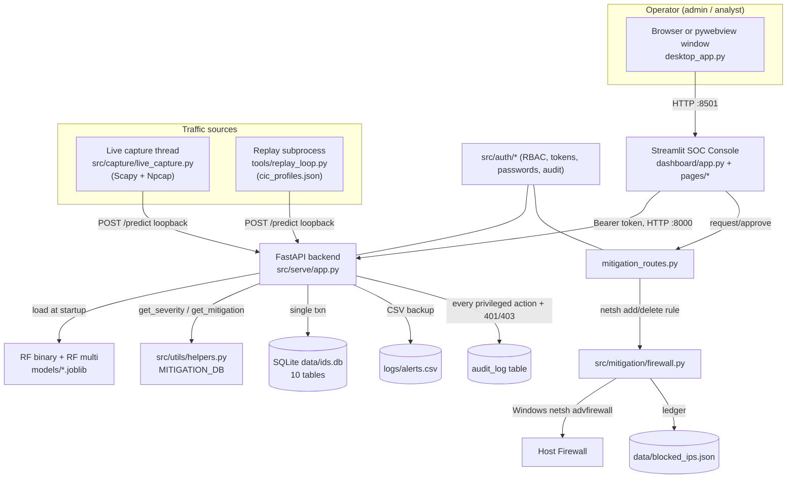

All components in the diagram exist in code. No planned-only components are shown.

---

## 13. Functional Modules

| Module ID | Name | Description | Related files | Inputs | Outputs | User role | Pre-condition | Post-condition | Status |
|---|---|---|---|---|---|---|---|---|---|
| M01 | Authentication | Login/logout/me, opaque bearer sessions | `src/serve/auth_routes.py`, `src/auth/tokens.py`, `src/auth/passwords.py`, `dashboard/auth_ui.py` | username/password | token, role, permissions | any | user exists, not locked/disabled | session row; audit `login` | IMPLEMENTED |
| M02 | RBAC / authorization | Two-role permission matrix dependency | `src/auth/rbac.py` | bearer token, permission | allow / 401 / 403 | any | valid token | audit on 401/403 | IMPLEMENTED |
| M03 | User management | Create/list users, change role/password, disable/enable | `src/serve/auth_routes.py`, `dashboard/pages/1_Users.py` | user fields | user rows | admin | admin session | `user` rows; audit | IMPLEMENTED |
| M04 | Audit log | Append-only log + filtered viewer + CSV export | `src/auth/audit.py`, `src/serve/auth_routes.py` (`/audit`), `dashboard/pages/2_Audit_Log.py` | filters | audit rows / CSV | admin | admin session | — | IMPLEMENTED |
| M05 | Live packet capture | Scapy sniff → flow aggregation → 50 features → /predict | `src/capture/live_capture.py`, `/capture/*` in `app.py`, sidebar | iface | flows POSTed | admin | admin elevation + Npcap | flows in DB (`source_mode='live'`) | IMPLEMENTED |
| M06 | Replay simulator | CIC-profile traffic generator | `tools/replay_loop.py`, `/replay/*` | rate, attack_ratio | flows POSTed | admin | API up | flows (`source_mode='replay'`) | IMPLEMENTED |
| M07 | Feature extraction / preprocessing | 5-tuple flow aggregation → 50 features (live); CIC CSV → 50 features (offline) | `src/capture/live_capture.py:FlowAggregator`, `src/data/prep_cic2017.py` | packets / CSV | 50-feature dict / parquet | system | — | feature vector | IMPLEMENTED |
| M08 | ML prediction (binary) | RF benign/attack at threshold | `src/serve/app.py:predict`, `models/rf_cic_binary.joblib` | features | score, label | system (loopback) | model loaded | detection row | IMPLEMENTED |
| M09 | Attack classification (multi) | 8-class RF on attack flows | `src/serve/app.py:predict`, `models/rf_cic_multi.joblib` | features | attack_type, confidence | system | label==1 | attack_type in DB | IMPLEMENTED |
| M10 | Severity + mitigation lookup | Score→severity tier; attack-type→recommendations | `src/utils/helpers.py` | score, attack_type | severity, recs | system | label==1 | `mitigation_record` row | IMPLEMENTED |
| M11 | Alert generation & persistence | Single-txn write of flow/detection/alert/mitigation | `src/utils/db.py:insert_flow_result` | prediction | DB rows | system | DB init | rows committed | IMPLEMENTED |
| M12 | Alerts / stats API + dashboard | Hot-cache alerts, SQL stats, charts | `app.py` (`/alerts`,`/stats`), `dashboard/app.py` | — | tables, KPIs, charts | any | session | — | IMPLEMENTED |
| M13 | Mitigation workflow | request → approve/deny → netsh; unblock; failures view | `src/serve/mitigation_routes.py`, `dashboard/pages/3_Mitigation.py` | alert_id, target_ip | request/action rows | analyst (request), admin (approve/deny/unblock) | attack alert exists | firewall rule + audit | IMPLEMENTED |
| M14 | Firewall enforcement | netsh add/delete inbound block; ledger | `src/mitigation/firewall.py` | IP | netsh result, ledger | system (admin-elevated) | is_admin | rule applied | IMPLEMENTED |
| M15 | Model training | Train binary+multi RF, threshold, metadata, PNGs | `src/models/train.py` | parquet | joblibs, meta, eval | offline (dev) | training data present | model artifacts | IMPLEMENTED (FROZEN) |
| M16 | Model evaluation | Metrics + confusion matrices + report | `src/models/train.py`, `evaluation/*` | val split | metrics.json, report | offline | training run | reports | IMPLEMENTED |
| M17 | Bootstrap admin | One-time first-admin CLI | `tools/bootstrap_admin.py` | username/password | admin row | operator | empty admin set | admin user + audit | IMPLEMENTED |
| M18 | Desktop window | pywebview native window | `desktop_app.py` | — | OS window | any | Streamlit up | window opens | IMPLEMENTED (NEW) |
| M19 | Mitigation recommendation API | `/mitigation/{type}/{severity}` lookup | `app.py`, `helpers.py` | type, severity | recommendation list | any | — | — | IMPLEMENTED (not surfaced per-alert in UI) |

**Note:** Recommendation text is stored (`mitigation_record.recommendations_json`)
and reachable via API, but the dashboard does **not** render per-alert
recommendation bullets — Status: **PARTIALLY IMPLEMENTED** for UI surfacing
(`CURRENT_STATE.md` §4/§11).

---

## 14. Functional Requirements

> IDs FR_01…FR_19. Every row is grounded in code. Proposal FR_01–FR_05 are the
> original Phase-1 requirements; FR_06+ are Phase-2 additions.

| ID | Name | Description | Input | Output | Basic Workflow | Requirements / Dependencies | Evidence Files | Status |
|----|------|-------------|-------|--------|----------------|-----------------------------|----------------|--------|
| FR_01 | Capture network traffic | Capture live packets from a selected interface | iface selection | flows | sidebar → /capture/start → Scapy sniff → flows | Scapy, Npcap, admin | `src/capture/live_capture.py`, `app.py /capture/*`, `dashboard/app.py` | IMPLEMENTED |
| FR_02 | Preprocess / feature-extract | Aggregate packets into 50-feature flows | packets / CSV | 50-feature dict | FlowAggregator (5-tuple, 5 s timeout) / prep_cic2017 | numpy | `src/capture/live_capture.py`, `src/data/prep_cic2017.py` | IMPLEMENTED |
| FR_03 | Classify traffic | Benign vs attack (+ family) via RF | features | label, score, attack_type | /predict → binary RF → (multi RF) | sklearn, models | `src/serve/app.py`, `models/*.joblib` | IMPLEMENTED |
| FR_04 | Generate alerts/logs/mitigation info | Persist detection chain + severity + recommendations | prediction | DB rows, CSV, recs | insert_flow_result txn + helpers | SQLite | `src/utils/db.py`, `src/utils/helpers.py` | IMPLEMENTED |
| FR_05 | View alerts/logs/mitigation | SOC dashboard for monitoring | session | tables, charts | poll /stats,/alerts; render | Streamlit, Plotly | `dashboard/app.py`, `pages/*` | IMPLEMENTED |
| FR_06 | User login/logout | Issue/revoke opaque bearer sessions | creds | token | /auth/login, /auth/logout | passlib/bcrypt | `src/serve/auth_routes.py`, `src/auth/tokens.py` | IMPLEMENTED |
| FR_07 | Role-based access control | Enforce admin/analyst permissions | token, perm | allow/deny | require_permission dependency | — | `src/auth/rbac.py` | IMPLEMENTED |
| FR_08 | User management | Create users, edit role/password, disable/enable | user fields | user rows | /users CRUD | admin | `src/serve/auth_routes.py`, `dashboard/pages/1_Users.py` | IMPLEMENTED |
| FR_09 | Audit logging | Record every privileged action + 401/403 | events | audit rows | log_audit on each action | SQLite | `src/auth/audit.py`, `src/auth/rbac.py` | IMPLEMENTED |
| FR_10 | Audit viewer/export | Filter + CSV export of audit log | filters | rows/CSV | /audit + page | admin | `src/serve/auth_routes.py`, `dashboard/pages/2_Audit_Log.py` | IMPLEMENTED |
| FR_11 | Replay traffic control | Start/stop replay subprocess | rate, ratio | flows | /replay/start|stop|status | — | `src/serve/app.py`, `tools/replay_loop.py` | IMPLEMENTED |
| FR_12 | Live capture control | Start/stop/status + interface list | iface | capture state | /capture/start|stop|status|interfaces | Scapy, admin | `src/serve/app.py`, `src/capture/live_capture.py` | IMPLEMENTED |
| FR_13 | Request mitigation (block) | Analyst requests block on attacker IP | alert_id, IP | pending request | POST /mitigation/requests | analyst | `src/serve/mitigation_routes.py`, `dashboard/app.py` | IMPLEMENTED |
| FR_14 | Approve/deny mitigation | Admin decides; two-person rule | request_id | decision + action | approve/deny endpoints | admin | `src/serve/mitigation_routes.py`, `dashboard/pages/3_Mitigation.py` | IMPLEMENTED |
| FR_15 | Enforce block via firewall | netsh inbound block of IP | IP | rule + ledger | firewall.block_ip | admin-elevated, Windows | `src/mitigation/firewall.py` | IMPLEMENTED |
| FR_16 | Unblock IP | Remove netsh rule | IP | rule removed | POST /mitigation/unblock | admin | `src/serve/mitigation_routes.py`, `firewall.unblock_ip` | IMPLEMENTED |
| FR_17 | View active blocks / failures | Enriched block list + failed executions | — | tables | /mitigation/blocked, /actions/failures | admin/any (blocked) | `src/serve/mitigation_routes.py`, `dashboard/pages/3_Mitigation.py` | IMPLEMENTED |
| FR_18 | Health/status | Liveness + model + elevation + running flags | — | JSON | GET /health | — | `src/serve/app.py` | IMPLEMENTED |
| FR_19 | Login lockout + timing eq. | Lock after 5 fails/15 min; equalize timing | creds | 401/lock | login path | — | `src/serve/auth_routes.py`, `src/auth/passwords.py` | IMPLEMENTED |

---

## 15. Non-Functional Requirements

| Category | Requirement | Explanation | Evidence / reason | Status |
|---|---|---|---|---|
| Usability | Simple GUI usable without deep cyber expertise | Login, buttons, color-coded tables, friendly NIC labels, self-IP exclusion, toasts | `dashboard/app.py`, `auth_ui.py` | IMPLEMENTED |
| Reliability | Continue through bad input without data loss | /predict survives DB hiccup (logs + CSV + cache); single-txn writes; WAL; netsh failures persisted not swallowed | `src/serve/app.py`, `src/utils/db.py`, `mitigation_routes.py` | IMPLEMENTED (no long-run/HA testing) |
| Performance | Classify in near real time | `/predict` ~ tens of ms warm (claim, unbenchmarked in repo); 4 s dashboard refresh; 5 s flow timeout | `RECONCILIATION_PHASE2.md` §2 (claim), `dashboard/app.py` | PARTIALLY VERIFIED (no benchmark artifact) |
| Security | AuthN/AuthZ, hashing, audit, lockout, loopback, pinned CORS | bcrypt cost 12; opaque 8 h tokens; RBAC; append-only audit; lockout; `/predict` loopback-only; CORS pinned | `src/auth/*`, `src/serve/app.py`, `auth_routes.py` | IMPLEMENTED |
| Maintainability | Modular, additive-only schema | Clear `src/{auth,capture,data,mitigation,models,serve,utils}`; additive DB rules | repo layout, `_project/HARD_CONSTRAINTS.md` | IMPLEMENTED |
| Portability | Runs on standard desktop | Python 3.12 cross-platform core; **but** netsh + Npcap = Windows-only mitigation/capture | `README.md`, `START.bat` | PARTIAL (Windows-bound features) |
| Scalability | Single-host scale | SQLite + in-proc; deliberate single-machine scope; not horizontally scalable | `_project/HARD_CONSTRAINTS.md`, `FUTURE_WORK.md` §1 | BY DESIGN (limited) |
| Availability | Supervisor restarts children; loopback only | `launch.py` supervises; no HA | `launch.py` | PARTIAL |
| Design constraints | Standalone, no cloud/external servers | Loopback bind; no outbound calls | `launch.py`, `app.py` | IMPLEMENTED |
| License | Open-source/academic components | Permissive deps; CIC-IDS2017 public-research license; academic-use note | `README.md` "Academic Use" | STATED (no LICENSE file in repo — see §28/§30) |

**DOC-DRIFT:** No formal performance benchmark file exists; the "<20 ms" / "under
one second" figures live only in prose (`RECONCILIATION_PHASE2.md` §2).

---

## 16. Assumptions, Dependencies, and Constraints

### Assumptions
- CIC-IDS2017 CSVs are present for CIC training (else `mock_data.py` fallback). Evidence: `prep_cic2017.py`, `START.bat`.
- Trained models exist in `models/` (they do, committed/gitignored locally). Evidence: directory listing.
- Operator has Python on PATH (venv auto-created by `START.bat`).
- For live capture: Npcap installed + API running **as administrator**.
- For mitigation: process **elevated** AND no kernel-mode AV intercepting (Avast etc.).
- Single fixed attacker IP in lab; demo network is isolated (VMware VMnet8 / Wi-Fi subnet).

### Dependencies
- **Libraries:** see §10 (`env/requirements.txt`).
- **OS:** Windows for `START.bat`, `netsh`, Npcap; loopback networking.
- **External tools:** Npcap (capture), Windows `netsh` (mitigation), Wireshark NOT required (PyShark dropped).
- **Dataset:** CIC-IDS2017 (8 CSVs in `data/downloads/...`).
- **Model files:** `models/*.joblib` + `model_meta.json` + `threshold.txt`.
- **Network permissions:** raw-socket/admin for capture; admin for firewall edits.

### Constraints
- **Hardware:** single machine; capture limited by one NIC; models ~170 MB combined in RAM.
- **Dataset:** CIC-IDS2017 (2017) — class imbalance (Web Attack/Bot/Infiltration scarce); balanced by down/over-sampling.
- **False positives/negatives:** binary head reliable on session attacks; **misses scan/flood** (singleton flows); multi-class drifts (nikto→DoS). Production FP rate **not measured**.
- **Real-time limits:** 5 s flow inactivity timeout; trailing flows emit after attack stops.
- **GUI limits:** Streamlit `pages/` shows admin pages to analysts (blocked at click, "OPTION X"); recommendation text not surfaced per-alert; no per-row buttons in HTML alert table.
- **Offline-only:** no cloud, no external feeds.
- **No-cloud/no-server constraint:** loopback-bound by design.
- **Legal/ethical (network monitoring):** capturing/blocking requires authorization; `MITIGATION_ALLOW_PRIVATE` is lab-only; public-IP-only default protects internal ranges; model never sees IP addresses (forensic-only). Evidence: `lab/ATTACK_VALIDATION.md` §6, `firewall.validate_ip`, `mitigation_routes.py` header.

---

## 17. Apportioning of Requirements (future versions)

All **PLANNED / NOT IMPLEMENTED** (sourced from `FUTURE_WORK.md` + `_project/HARD_CONSTRAINTS.md`):

| Deferred feature | Where designed | Est. effort |
|---|---|---|
| Endpoint agent / multi-machine fleet | `FUTURE_WORK.md` §1 | 6–8 eng-wk |
| Scan/flood detection (burst aggregator) | §2 | 3–4 eng-wk |
| Auto-block on high-confidence detection (opt-in) | §3 | 2–3 eng-wk |
| Encrypted-channel detection (JA3/SNI) | §4 | 4–6 eng-wk |
| Cloud / threat-intel integration (opt-in) | §5 | 2 eng-wk |
| Production-grade UI (React/Vue SPA + websockets) | §6 | 8–12 eng-wk |
| AV/WFP co-existence hardening + unblock recovery | §7 | 1–10 eng-wk |
| Retraining pipeline + multi-class drift monitor | §8 | 5–7 eng-wk |
| PDF report export | `CURRENT_STATE.md` §11 | M |
| Multi-dataset support (UNSW-NB15, NSL-KDD) | `CURRENT_STATE.md` §11 | L |
| Centralize API base URL (config module) | `CURRENT_STATE.md` §11 | S |

Out of scope by hard constraint: PostgreSQL, frontend rewrite, Docker shipping,
installers, multi-tenant, OAuth/SSO/2FA, Linux iptables branch, >2 roles.

---

## 18. Use Case Analysis

> Aligned to proposal UC_01–UC_05 and extended with Phase-2 use cases.

### UC_01 — Capture Network Traffic
| Field | Details |
|---|---|
| Use Case ID | UC_01 |
| Use Case Name | Capture network traffic |
| Description | Admin starts live packet capture on a chosen interface |
| Primary Actor | Admin |
| Secondary Actor | System (Scapy/Npcap) |
| Pre-condition | API elevated, Npcap installed, signed in as admin |
| Post-condition | Flows POSTed to /predict; `traffic_flow.source_mode='live'` |
| Basic Flow | Admin picks iface → clicks Start → /capture/start → sniff thread runs → flows flow to /predict |
| Alternate Flow | No interfaces listed → dropdown disabled |
| Exception Flow | Not elevated → 403 `admin_required` toast; Scapy missing → 500 `scapy_missing` |
| Related FR | FR_01, FR_12 |
| Evidence Files | `src/capture/live_capture.py`, `src/serve/app.py`, `dashboard/app.py` |
| Status | IMPLEMENTED |

### UC_02 — Preprocess / Extract Features
| Field | Details |
|---|---|
| Use Case ID | UC_02 |
| Use Case Name | Preprocess network traffic |
| Description | Aggregate packets to 50-feature flows (or CIC CSV → schema) |
| Primary Actor | System |
| Secondary Actor | — |
| Pre-condition | Packets captured / CSVs present |
| Post-condition | 50-feature vector ready for prediction |
| Basic Flow | Packet → FlowAggregator (5-tuple) → on timeout emit 50 features |
| Alternate Flow | Offline: prep_cic2017 maps 78 CIC cols → 50 features |
| Exception Flow | Missing features zero-filled (`build_feature_df`) |
| Related FR | FR_02 |
| Evidence Files | `src/capture/live_capture.py`, `src/data/prep_cic2017.py`, `src/serve/app.py` |
| Status | IMPLEMENTED |

### UC_03 — Classify Traffic
| Field | Details |
|---|---|
| Use Case ID | UC_03 |
| Use Case Name | Classify network traffic |
| Description | RF binary + multi classification of a flow |
| Primary Actor | System (loopback caller) |
| Secondary Actor | ML models |
| Pre-condition | Models loaded; caller is loopback |
| Post-condition | label/score/attack_type returned + persisted |
| Basic Flow | /predict → binary proba → threshold → if attack, multi → severity/mitigation |
| Alternate Flow | Multi model absent → binary-only mode |
| Exception Flow | Non-loopback caller → 403; model not loaded → 503 |
| Related FR | FR_03 |
| Evidence Files | `src/serve/app.py:predict`, `models/*.joblib` |
| Status | IMPLEMENTED |

### UC_04 — Generate Alerts, Logs, Mitigation Info
| Field | Details |
|---|---|
| Use Case ID | UC_04 |
| Use Case Name | Generate alerts/logs/mitigation info |
| Description | Persist detection chain; assign severity; store recommendations |
| Primary Actor | System |
| Pre-condition | A prediction produced |
| Post-condition | Rows in traffic_flow/detection_result(/alert/mitigation_record); CSV append |
| Basic Flow | insert_flow_result single txn → CSV log → hot cache |
| Alternate Flow | Benign → only flow + detection rows |
| Exception Flow | DB error → request still returns (CSV+cache) |
| Related FR | FR_04, FR_09 |
| Evidence Files | `src/utils/db.py`, `src/utils/helpers.py` |
| Status | IMPLEMENTED |

### UC_05 — View Alerts, Logs, Mitigation Info
| Field | Details |
|---|---|
| Use Case ID | UC_05 |
| Use Case Name | View alerts/logs/mitigation |
| Description | Monitor detections + state on dashboard |
| Primary Actor | Admin / Analyst |
| Pre-condition | Signed in |
| Post-condition | — |
| Basic Flow | Poll /stats,/alerts,/health → render KPIs, table, charts |
| Alternate Flow | Hot cache empty → CSV fallback |
| Exception Flow | API offline → "API OFFLINE" chip |
| Related FR | FR_05 |
| Evidence Files | `dashboard/app.py` |
| Status | IMPLEMENTED |

### UC_06 — Authenticate (Login/Logout)
| Field | Details |
|---|---|
| Use Case ID | UC_06 |
| Primary Actor | Admin / Analyst |
| Pre-condition | User exists, not locked/disabled |
| Post-condition | Session created/revoked; audit row |
| Basic Flow | Enter creds → /auth/login → token → /auth/me → session_state |
| Exception Flow | Wrong creds → 401; 5 fails → 15-min lock (`auth.login.locked`) |
| Related FR | FR_06, FR_19 |
| Evidence Files | `dashboard/auth_ui.py`, `src/serve/auth_routes.py` |
| Status | IMPLEMENTED |

### UC_07 — Manage Users (admin)
| Field | Details |
|---|---|
| Use Case ID | UC_07 |
| Primary Actor | Admin |
| Pre-condition | admin session |
| Post-condition | user rows changed; audit; disabling revokes sessions |
| Basic Flow | /users list/create/patch; UI forms |
| Exception Flow | self-demote/self-disable blocked (400); dup username 409 |
| Related FR | FR_08 |
| Evidence Files | `dashboard/pages/1_Users.py`, `src/serve/auth_routes.py` |
| Status | IMPLEMENTED |

### UC_08 — Control Traffic Source (admin)
| Field | Details |
|---|---|
| Use Case ID | UC_08 |
| Primary Actor | Admin |
| Basic Flow | Start/stop replay; start/stop capture; pick iface |
| Related FR | FR_11, FR_12 |
| Evidence Files | `dashboard/app.py`, `src/serve/app.py` |
| Status | IMPLEMENTED |

### UC_09 — Request Mitigation (analyst)
| Field | Details |
|---|---|
| Use Case ID | UC_09 |
| Primary Actor | Analyst (admin also has perm) |
| Pre-condition | An attack alert with alert_id + resolvable public src_ip |
| Post-condition | `mitigation_request` pending; audit |
| Basic Flow | Expander → pick attacker → Request Block → POST /mitigation/requests |
| Exception Flow | Private IP → 400 (unless lab override); duplicate pending → 409; self-IP excluded |
| Related FR | FR_13 |
| Evidence Files | `dashboard/app.py`, `src/serve/mitigation_routes.py` |
| Status | IMPLEMENTED |

### UC_10 — Approve/Deny & Enforce Block (admin)
| Field | Details |
|---|---|
| Use Case ID | UC_10 |
| Primary Actor | Admin |
| Pre-condition | pending request; admin session |
| Post-condition | netsh rule + `mitigation_action`; request approved/denied; audit chain |
| Basic Flow | Mitigation page → Approve & Block → firewall.block_ip → ledger |
| Exception Flow | Two-person rule (<5 s) → 403; netsh failure → 200 + warning, recorded as failure |
| Related FR | FR_14, FR_15 |
| Evidence Files | `dashboard/pages/3_Mitigation.py`, `src/serve/mitigation_routes.py`, `src/mitigation/firewall.py` |
| Status | IMPLEMENTED |

### UC_11 — Unblock IP (admin)
| Field | Details |
|---|---|
| Use Case ID | UC_11 |
| Primary Actor | Admin |
| Pre-condition | prior mitigation_request exists for that IP |
| Post-condition | netsh rule removed; `mitigation_action` unblock; audit |
| Exception Flow | No prior request → 400 |
| Related FR | FR_16 |
| Evidence Files | `dashboard/pages/3_Mitigation.py`, `src/serve/mitigation_routes.py` |
| Status | IMPLEMENTED |

### UC_12 — View Audit Log (admin)
| Field | Details |
|---|---|
| Use Case ID | UC_12 |
| Primary Actor | Admin |
| Basic Flow | Filter (limit/since/action/actor/status) → /audit → table → CSV export |
| Related FR | FR_10 |
| Evidence Files | `dashboard/pages/2_Audit_Log.py`, `src/serve/auth_routes.py` |
| Status | IMPLEMENTED |

**Aggregated Use Case Diagram (Mermaid):**

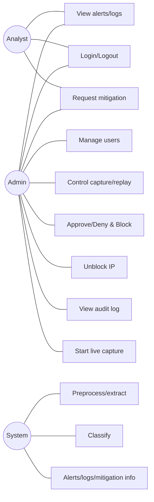

---

## 19. Design Diagrams Information

### 19.1 Architecture Diagram
- **Enough info?** Yes. Components in §12. Mermaid in §12. Source-of-truth ASCII
  also exists in `README.md` and `CURRENT_STATE.md` §3.

### 19.2 ERD with Data Dictionary
- **Enough info?** Yes — full DDL in `src/utils/db.py:SCHEMA_DDL`. **10 tables.**
  Phase-1 ERD (4) + Week-2 auth (3) + Week-3 mitigation (2) + Week-4 security (1).

**ERD (Mermaid):**

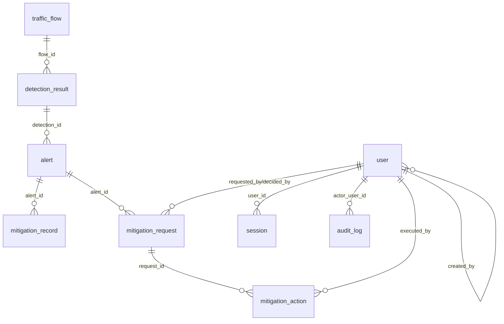

**Data dictionary (key columns; full DDL at `src/utils/db.py:40-194`):**

| Entity | Attribute | Type | Description | Constraints | Evidence |
|---|---|---|---|---|---|
| traffic_flow | id | INTEGER | PK | PK AUTOINCREMENT | db.py |
| traffic_flow | ts | TEXT | timestamp | NOT NULL | db.py |
| traffic_flow | flow_id | TEXT | external flow id | NOT NULL | db.py |
| traffic_flow | src_ip,dst_ip | TEXT | endpoints | nullable | db.py |
| traffic_flow | src_port,dst_port,protocol | INTEGER | L4 ids | nullable | db.py |
| traffic_flow | duration | REAL | flow_duration | nullable | db.py |
| traffic_flow | source_mode | TEXT | replay/live/manual | CHECK in set, NOT NULL | db.py |
| traffic_flow | raw_features_json | TEXT | full 50-feature dict | NOT NULL | db.py |
| detection_result | flow_id | INTEGER | FK→traffic_flow.id | NOT NULL, ON DELETE CASCADE | db.py |
| detection_result | score | REAL | binary proba | NOT NULL | db.py |
| detection_result | label | INTEGER | 0/1 | NOT NULL | db.py |
| detection_result | label_text | TEXT | Benign/Attack | NOT NULL | db.py |
| detection_result | attack_type | TEXT | family | nullable | db.py |
| detection_result | attack_confidence | REAL | multi proba | nullable | db.py |
| detection_result | model_version | TEXT | loaded model name | nullable | db.py |
| detection_result | threshold | REAL | decision threshold | nullable | db.py |
| alert | detection_id | INTEGER | FK→detection_result.id | NOT NULL, CASCADE | db.py |
| alert | severity | TEXT | Critical/High/Medium/Low | NOT NULL | db.py |
| alert | status | TEXT | default 'open' | NOT NULL | db.py |
| mitigation_record | alert_id | INTEGER | FK→alert.id | NOT NULL, CASCADE | db.py |
| mitigation_record | attack_type,severity,description | TEXT | recommendation meta | nullable | db.py |
| mitigation_record | recommendations_json | TEXT | JSON array of strings | NOT NULL | db.py |
| user | username | TEXT | login name | UNIQUE NOT NULL | db.py |
| user | password_hash | TEXT | bcrypt $2b$12$… | NOT NULL | db.py |
| user | role | TEXT | admin/analyst | CHECK in set | db.py |
| user | created_by | INTEGER | FK→user.id (self) | nullable | db.py |
| user | disabled_at,last_login_at | TEXT | lifecycle | nullable | db.py |
| session | token | TEXT | 32-byte url-safe | UNIQUE NOT NULL | db.py |
| session | user_id | INTEGER | FK→user.id | NOT NULL | db.py |
| session | created_at,expires_at | TEXT | TTL = +8h | NOT NULL | db.py |
| session | revoked_at,last_seen_at,user_agent,ip_address | TEXT | session meta | nullable | db.py |
| audit_log | ts,action,status | TEXT | event, success/failure | NOT NULL (status CHECK) | db.py |
| audit_log | actor_user_id | INTEGER | FK→user.id | nullable | db.py |
| audit_log | actor_username,target,detail,ip_address,user_agent | TEXT | context | nullable | db.py |
| mitigation_request | alert_id | INTEGER | FK→alert.id | NOT NULL | db.py |
| mitigation_request | target_ip | TEXT | IP to block | NOT NULL | db.py |
| mitigation_request | requested_by | INTEGER | FK→user.id | NOT NULL | db.py |
| mitigation_request | status | TEXT | pending/approved/denied/expired/cancelled | CHECK | db.py |
| mitigation_request | decided_by,decided_at,decision_note,reason | — | decision meta | nullable | db.py |
| mitigation_action | request_id | INTEGER | FK→mitigation_request.id | NOT NULL | db.py |
| mitigation_action | action_type | TEXT | block/unblock | CHECK | db.py |
| mitigation_action | target_ip,executed_by,executed_at,status | — | execution | NOT NULL (status CHECK) | db.py |
| mitigation_action | netsh_stdout,netsh_stderr,error_detail | TEXT | netsh result | nullable | db.py |
| login_attempts | username | TEXT | PK | PK | db.py |
| login_attempts | failure_count | INTEGER | fails | NOT NULL default 0 | db.py |
| login_attempts | locked_until,last_failure_at | TEXT | lock window | nullable | db.py |

### 19.3 DFD Level 0
- External entities: **Operator** (admin/analyst), **Network/Attacker traffic**.
- Process: **AI-IDS System**.
- Data stores: `data/ids.db`, `logs/alerts.csv`, `data/blocked_ips.json`.

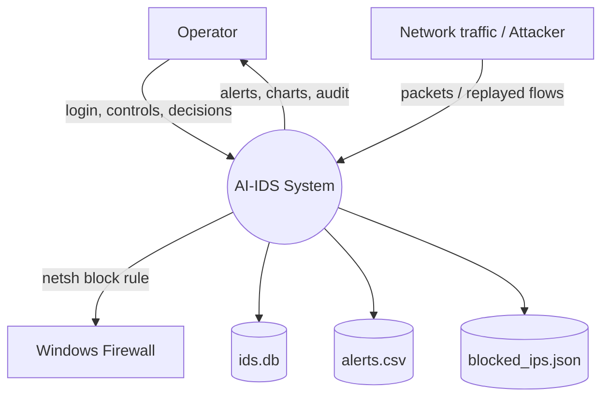

### 19.4 DFD Level 1

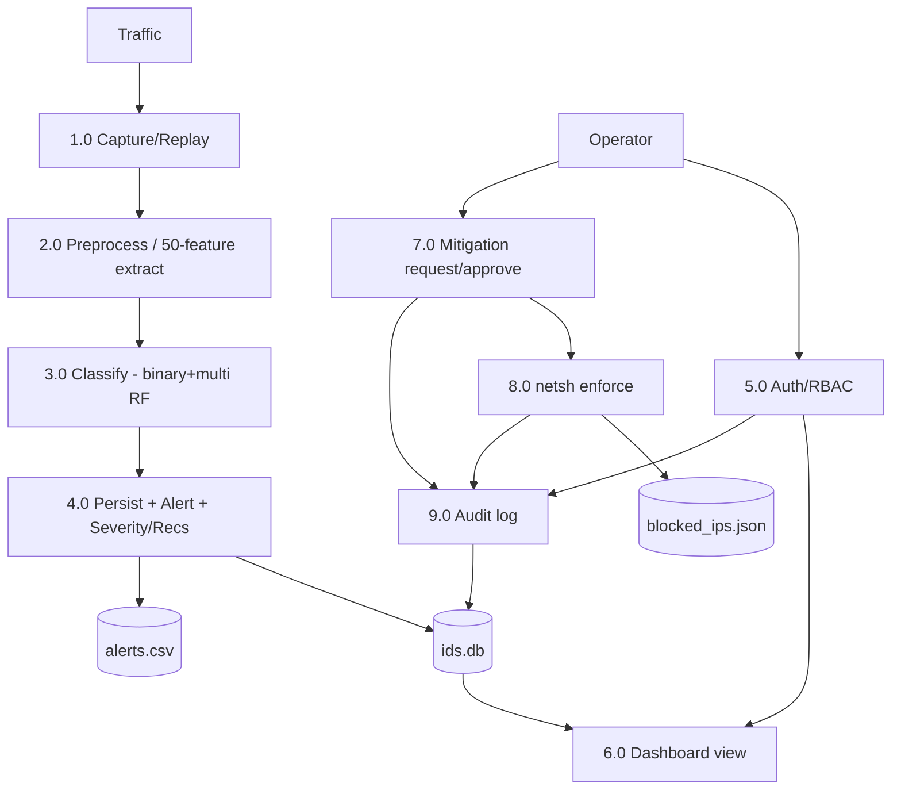

All subprocesses supported by code. Scan/flood detection NOT present.

### 19.5 Class Diagram
- **Enough info?** Partially. The codebase is **mostly module-level functions**,
  not OOP. Real classes: `FlowAggregator` (`src/capture/live_capture.py`), and
  Pydantic models in `app.py`/`auth_routes.py`/`mitigation_routes.py`.

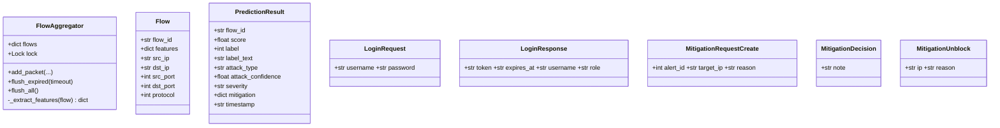

Module "services" (not classes) to depict as components: `db`, `helpers`,
`passwords`, `tokens`, `rbac`, `audit`, `firewall`.

### 19.6 Activity Diagrams
**/predict (detection) activity:**
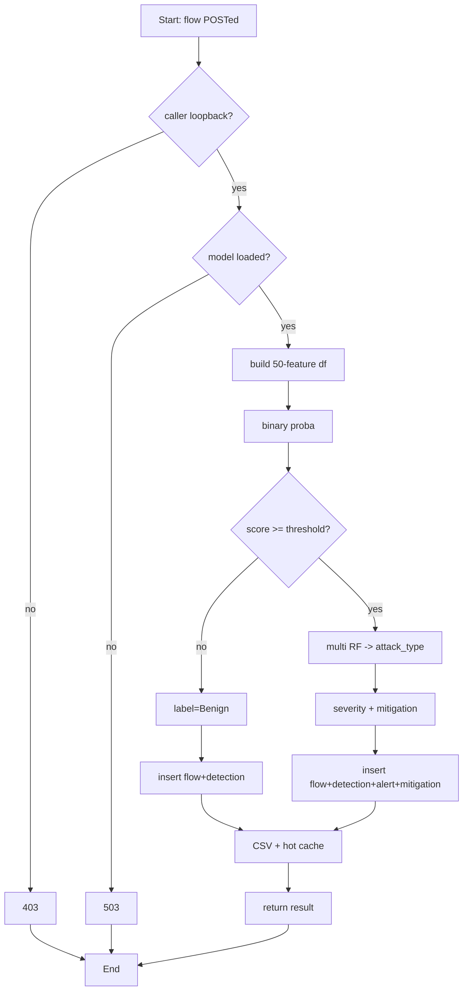

**Mitigation approval activity:**
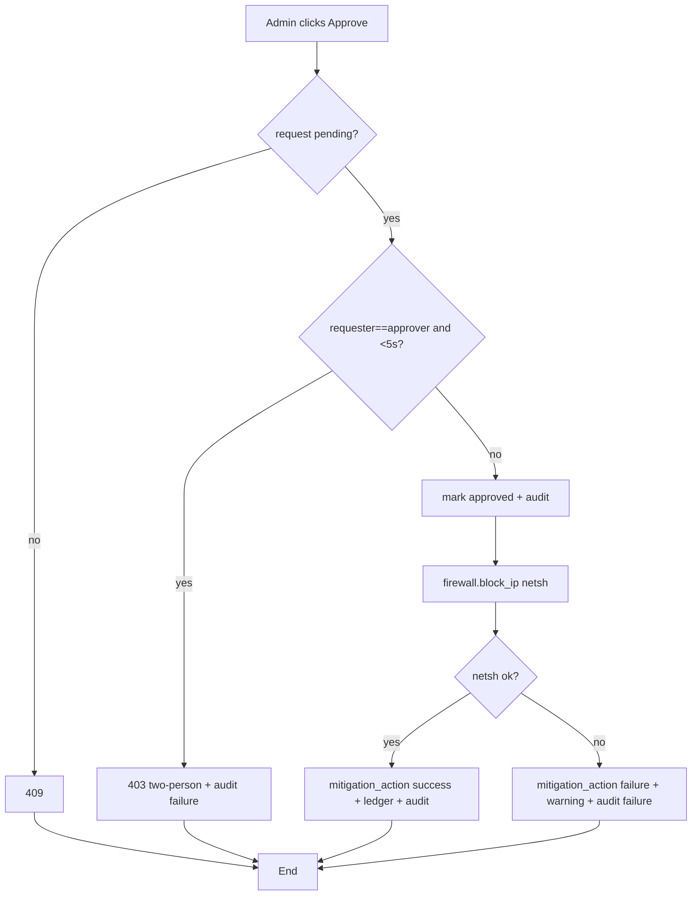

### 19.7 Sequence Diagrams
**Detection (live capture):**
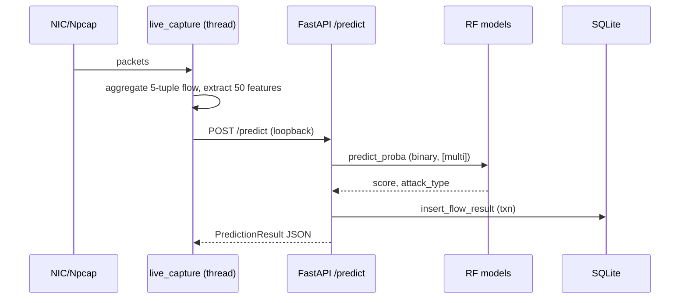

**Mitigation chain:**
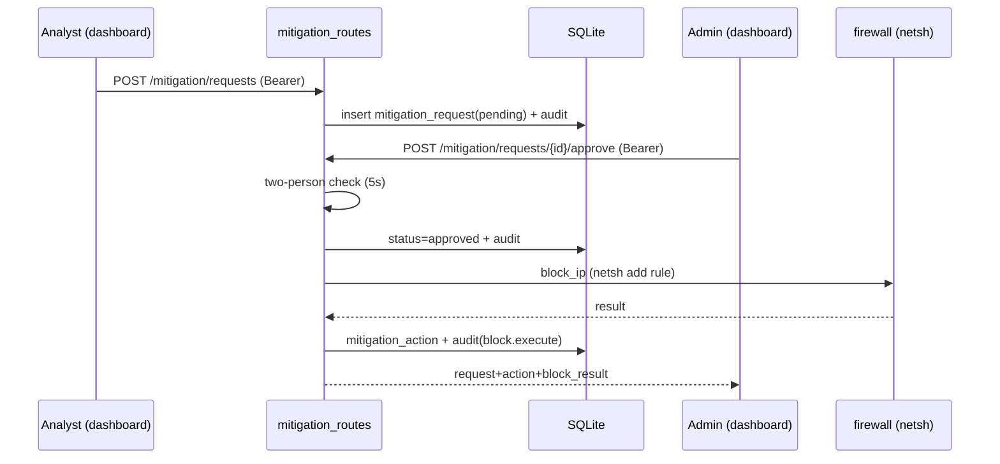

### 19.8 Collaboration Diagram (textual / object messages)
1. `dashboard/auth_ui.api_request()` → 2. `auth_routes.auth_login()` →
3. `passwords.verify_password()` → 4. `tokens.create_session()` →
5. `audit.log_audit()`. Then for mitigation: 6. `app/mitigation_routes` ⇄
7. `rbac.require_permission` ⇄ 8. `tokens.validate_token` →
9. `firewall.block_ip` → 10. ledger write + `audit.log_audit`. (No Mermaid
collaboration primitive; represent as numbered object-message list.)

### 19.9 State Transition Diagram
**Mitigation request states (from DB CHECK constraint):**
```mermaid
stateDiagram-v2
    [*] --> pending
    pending --> approved: admin approve (>=5s, not self)
    pending --> denied: admin deny
    pending --> expired: (status value exists; no auto-expiry code)
    pending --> cancelled: (status value exists; no cancel endpoint)
    approved --> [*]
    denied --> [*]
```
Note: `expired`/`cancelled` are valid status values in the schema but **no code
transitions a request into them** — Status: schema-defined, **NOT IMPLEMENTED**
as flows.

**Capture session states:** `idle → running → stopped` (`/capture/start|stop|status`).

### 19.10 Component Diagram
Components (all exist): **Desktop window** (pywebview) · **Dashboard** (Streamlit)
· **API** (FastAPI) · **Auth/RBAC/Audit** · **Capture** (Scapy) · **Replay** ·
**ML models** · **Persistence** (SQLite) · **Mitigation** (netsh) · **Helpers**
(severity/mitigation DB) · external libs (sklearn, scapy, plotly, passlib).

### 19.11 Deployment Diagram
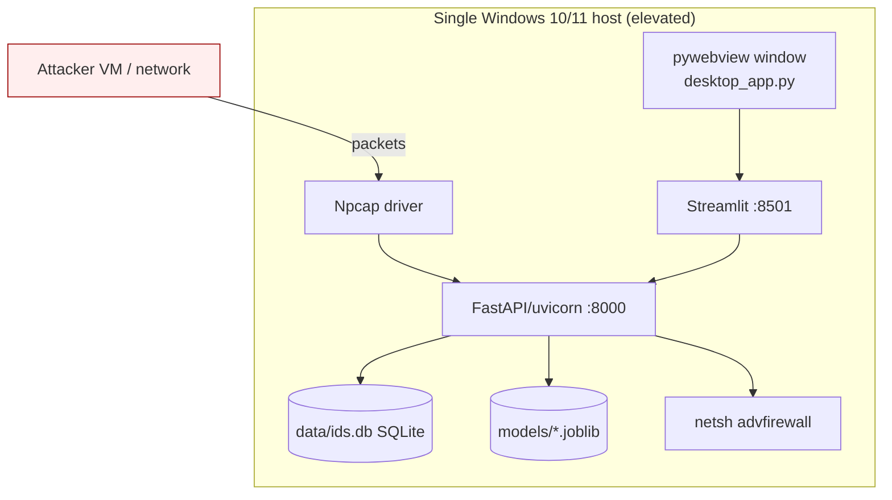
No server/cloud node — single host only.

---

## 20. Dataset and Machine Learning Details

**Dataset.** CIC-IDS2017 (Canadian Institute for Cybersecurity).
- **Location in repo:** `data/downloads/MachineLearningCSV/MachineLearningCVE/`
  (8 CSVs: Monday, Tuesday, Wednesday, Thursday Morning WebAttacks, Thursday
  Afternoon Infilteration, Friday Morning, Friday PortScan, Friday DDos).
- **Format:** CSV (78 native columns) → mapped to 50 unified features → Parquet
  (`data/processed/train.parquet`, ~40 MB).
- **Synthetic alternative:** `src/data/mock_data.py` produces the same 50-feature
  schema (fallback when CIC absent; `START.bat` uses it on first run).

**Features used (50, exact order from `models/model_meta.json`):**
flow_duration, total_fwd_packets, total_backward_packets,
total_length_of_fwd_packets, total_length_of_bwd_packets,
fwd_packet_length_mean, bwd_packet_length_mean, flow_iat_mean, flow_iat_std,
fwd_iat_mean, bwd_iat_mean, syn_flag_count, rst_flag_count, psh_flag_count,
ack_flag_count, fin_flag_count, urg_flag_count, destination_port, down_up_ratio,
init_win_bytes_forward, init_win_bytes_backward, active_mean, idle_mean,
flow_bytes_per_s, flow_packets_per_s, packet_length_mean, packet_length_std,
min_packet_length, max_packet_length, average_packet_size, avg_fwd_segment_size,
avg_bwd_segment_size, fwd_packets_per_s, bwd_packets_per_s, fwd_psh_flags,
fwd_urg_flags, fwd_header_length, bwd_header_length, fwd_packet_length_max,
fwd_packet_length_std, bwd_packet_length_max, bwd_packet_length_std,
fwd_iat_std, bwd_iat_std, subflow_fwd_packets, subflow_fwd_bytes,
subflow_bwd_packets, subflow_bwd_bytes, active_std, idle_std.
**No IP addresses are model inputs** (forensic-only). Evidence:
`src/data/prep_cic2017.py:UNIFIED_FEATURES`, `models/model_meta.json`.

**Target labels / classes (8):** Benign, Bot, Brute Force, DDoS, DoS,
Infiltration, Port Scan, Web Attack. Binary label = (attack_type != Benign).
Evidence: `data/processed/class_map.json`, `model_meta.json`.

**Preprocessing / cleaning (`src/data/prep_cic2017.py`):**
- Strip whitespace from column names; map 78 CIC cols → 50 snake_case features.
- Collapse CIC labels → 8 families (`map_family`); Heartbleed → DoS; drop "Other".
- Coerce numeric; replace ±inf → NaN; drop rows where critical cols all NaN; fill remaining NaN = 0.
- Derive missing features with documented formulas (e.g. active_std = active_mean*0.5).

**Encoding/scaling.** No categorical encoding needed (all numeric). **RobustScaler**
inside each model Pipeline (`src/models/train.py`).

**Class balancing.** Downsample majority to **100,000/class**; oversample rare to
**500/class** with 1% Gaussian noise. Final balanced distribution
(`data/processed/data_info.json`): Benign 100,000 · DDoS 100,000 · DoS 100,000 ·
Port Scan 100,000 · Brute Force 15,342 · Bot 1,966 · Web Attack 673 ·
Infiltration 500. **Total processed rows: 418,481.**

**Train/test split.** 80/20 `train_test_split`, `stratify=y_multi`,
`random_state=42` (`src/models/train.py:449`). Test set size in report = 83,697.

**Algorithms/models.** Two `Pipeline(RobustScaler → RandomForestClassifier)`:
- **Binary (CIC):** `n_estimators=500, max_depth=30, min_samples_leaf=3, class_weight="balanced_subsample", random_state=42`.
- **Multi (CIC):** `n_estimators=600, max_depth=35, min_samples_leaf=2, class_weight="balanced_subsample", random_state=42`.
- Threshold = F1-argmax over precision_recall_curve.

**Training script.** `src/models/train.py` (FROZEN by HARD_CONSTRAINTS). **No
separate evaluate script** — training writes the report.

**Saved models.** `rf_binary.joblib`, `rf.joblib` (binary copies),
`rf_cic_binary.joblib`; `rf_multi.joblib`, `rf_cic_multi.joblib`.
Runtime loads `rf_cic_binary` then falls back to `rf_binary`/`rf`; multi loads
`rf_cic_multi` then `rf_multi`. Metadata: `models/model_meta.json`;
threshold: `models/threshold.txt` = `0.385841` (meta stores `0.38584062950485853`).

**Model loading / prediction pipeline.** `src/serve/app.py:lifespan` loads
models + meta + threshold + `db.init_db()` + hydrates hot cache;
`predict()` builds the 50-feature DataFrame (zero-fills missing), runs binary
`predict_proba[:,1]`, thresholds, runs multi if attack (with Benign-skip
fallback to next-best class), assigns severity, looks up mitigation.

**Metrics — VERIFIED from `models/model_meta.json` + `evaluation/metrics.json`
+ `evaluation/evaluation_report.txt` (CIC-IDS2017 held-out test set, trained
2026-02-13):**

Binary (Benign vs Attack):
| Metric | Value |
|---|---|
| Accuracy | 0.9986 |
| F1 | 0.9991 |
| Precision | 0.999 |
| Recall | 0.9992 |
| AUC-ROC | 0.9999 |
| Average Precision (AP) | 1.0 |

Binary confusion matrix (test set, n=83,697):
```
                Pred:Benign  Pred:Attack
   True:Benign     19936           64
   True:Attack        51        63646
```

Multi-class:
| Metric | Value |
|---|---|
| Accuracy | 0.9962 |
| F1 macro | 0.9291 |
| F1 weighted | 0.9969 |

Per-class F1: Benign 0.9977 · Bot 0.9862 · Brute Force 0.9616 · DDoS 0.9997 ·
DoS 0.9994 · Infiltration 1.0 · Port Scan 0.9997 · **Web Attack 0.4884** (lowest;
explained in `QA_BANK.md` Q31 — class scarcity + HTTP feature overlap). Full
multi-class confusion matrix is in `evaluation/evaluation_report.txt`.

**IMPORTANT for documentation:** These are **test-set** metrics on CIC-IDS2017.
They are **NOT** the live-attack recall (which is much lower — see §21/§23 and
`lab/ATTACK_VALIDATION.md`). Do not present test-set accuracy as live/production
performance.

**Limitations.** Web Attack weak in multi-class; scan/flood undetected; multi-class
drifts on novel attacks (nikto→DoS); 2017 dataset; no production FP rate; balancing
oversample creates near-duplicates.

---

## 21. Threat Detection and Mitigation Details

**Attack classes detected (multi-class):** Bot, Brute Force, DDoS, DoS,
Infiltration, Port Scan, Web Attack (+ Benign). Evidence: `model_meta.json`.

**Normal vs malicious labels.** Binary `label` 0=Benign / 1=Attack at threshold
0.3858; `label_text` "Benign"/"Attack". Detection is **both** binary (primary
decision) **and** multi-class (family, when attack).

**Severity tiers (`src/utils/helpers.py:get_severity`, score-based, only when
label==1):** Critical ≥0.95, High ≥0.80, Medium ≥0.60, Low ≥0.40 (else Low).

**Alert shown.** Dashboard "Recent Alerts" row: time, source IP, attack type,
score chip (HIGH/MED/NEAR/LOW vs threshold), severity chip, alert ID, flow ID;
attack rows tinted red. KPIs + "Live State" strip + flow-stage strip.

**Logs saved.** `traffic_flow/detection_result/alert/mitigation_record` rows;
`logs/alerts.csv` backup (5 MB rotation); audit log; netsh ledger.

**Mitigation: automatic or manual?** **Manual / human-in-loop only.** No
auto-block exists (auto-block is `FUTURE_WORK.md` §3, PLANNED). Chain:
analyst request → admin approve (≥5 s, not self) → `netsh advfirewall firewall
add rule dir=in action=block remoteip=<ip>` → ledger + audit. Unblock symmetric.

**Exact mitigation action + code evidence.** `src/mitigation/firewall.py:block_ip`
builds argv `["netsh","advfirewall","firewall","add","rule","name=AI-IDS Block <ip>","dir=in","action=block","remoteip=<ip>"]`, 10 s timeout, idempotent
(checks existing rule), requires `is_admin()`, validates IP public-only unless
`allow_private`. Ledger at `data/blocked_ips.json`.

**Recommendation text.** `MITIGATION_DB` in `src/utils/helpers.py` covers **7
attack families × 4 severities = 28 recommendation sets**, each family with a
`description`, plus a `GENERIC_MITIGATION` fallback. Stored in
`mitigation_record.recommendations_json`; reachable at
`/mitigation/{type}/{severity}`. **Not surfaced per-alert in the dashboard.**

**Is mitigation only recommendations/alerts, or real enforcement?** **Real
host-level enforcement** via netsh (verified live against Kali on 2026-05-25;
`data/blocked_ips.json` shows real block/unblock entries) **plus** static
recommendation text. Enforcement is host-level only (not network/router-level)
and requires elevation + no kernel-mode AV interfering.

---

## 22. GUI / User Interface Details

**Framework.** Streamlit (multi-page via `dashboard/pages/`), Plotly charts,
`streamlit-autorefresh` (4 s), custom CSS "SOC console" dark theme; rendered in
browser **or** native pywebview window (`desktop_app.py`).

**Navigation flow.** Login screen (`auth_ui.require_login` gate) → main console
(`app.py`) with role-aware sidebar; Streamlit auto-nav lists pages Users / Audit
Log / Mitigation (admin pages hard-stop for analysts — "OPTION X" defense-in-depth).

**Screen-by-screen:**

| Screen | Purpose | Inputs | Outputs | Actions | Evidence File | Status |
|---|---|---|---|---|---|---|
| Login | Authenticate | username, password | session, error toasts | Sign in | `dashboard/auth_ui.py` | IMPLEMENTED |
| Main SOC Console | Monitor + control + request block | iface select, buttons, attacker pick | API/elev chips, Live State (5 cards), flow-stage strip, alerts table, score histogram (with threshold line), Top-10 source IPs bar | Start/Stop replay (admin), Start/Stop capture (admin), Request Block (analyst+), Sign out | `dashboard/app.py` | IMPLEMENTED |
| Users (page 1) | Manage users | username/password/role, toggles | user table, badges (role/you/disabled) | Create, change role, reset password, disable/enable | `dashboard/pages/1_Users.py` | IMPLEMENTED (admin) |
| Audit Log (page 2) | Review chain-of-custody | limit/since/action/actor/status | summary metrics, records table | Apply filters, Export CSV | `dashboard/pages/2_Audit_Log.py` | IMPLEMENTED (admin) |
| Mitigation (page 3) | Approve/deny + manage blocks | approval/deny notes, IP to unblock | pending request cards, state-machine strip, active-blocks banner/table, failed-executions table | Approve & Block, Deny, Unblock | `dashboard/pages/3_Mitigation.py` | IMPLEMENTED (admin) |
| Desktop window | Native shell | — | OS window titled "AI-IDS — Intrusion Detection & Threat Mitigation" (1500×950) | open/close | `desktop_app.py` | IMPLEMENTED (NEW) |
| FastAPI Swagger | API docs/testing | — | OpenAPI UI | try endpoints | `/docs` (FastAPI default) | IMPLEMENTED |

**Buttons/actions present.** Sign in/out; Replay Start/Stop; Capture Start/Stop +
interface dropdown; Request Block; Approve & Block; Deny; Unblock; Create user;
Update role; Reset password; Disable/Re-enable; Apply filters; Export CSV.

**Tables/charts/log panels.** Recent Alerts (custom HTML table, max 200 rows);
Score Distribution (Plotly histogram, 25 bins, threshold vline); Top-10 Source
IPs (Plotly horizontal bar); Users dataframe; Audit records dataframe + 4
metrics; Pending request cards; Active Blocks dataframe; Failed Executions
dataframe.

**Screenshots in repo.** **NOT FOUND IN REPOSITORY** (only `assets/icon*.png/ico`
exist — these are app icons, not screenshots). `reports/` PNGs (confusion matrix,
threshold curve) are produced only when training runs with matplotlib; not
committed (gitignored). `defense/demo_backup.mp4` referenced but **not in repo**.

**User manual info.** See §25 (derived from `README.md` + `defense/DEMO_SCRIPT.md`).

---

## 23. Testing Information

**Existing automated tests (24 total across 4 files; `pytest tests/`):**
- `tests/test_smoke.py` — 3 tests: app boot + `/health`; all 9 core tables present; full chain (admin/analyst login → /predict → analyst request → admin approve with mocked netsh → audit actions present).
- `tests/test_firewall.py` — 6 tests: validate_ip (private/loopback/link-local/invalid/public), not-admin block, happy-path argv, idempotent block, unblock happy+idempotent, ledger round-trip.
- `tests/test_mitigation_routes.py` — 12 tests (V1–V12): happy path, two-person rule fires, deny-own allowed, duplicate 409, private-IP gating by env, netsh-failure no-revert, approve-non-pending 409, permission gates (analyst 403/401), unblock-no-prior 400, unblock happy linking, list ordering+usernames+filter, blocked enrichment.
- `tests/test_login_lockout.py` — 3 tests: missing-user dummy verify, lockout after 5, counter reset on success.

Real netsh/capture/elevation are never invoked in tests (mocked / TestClient).
`.pytest_cache` present (tests have been run). README claims full suite ~24 s.

### 23.1 Test Case Specifications (documentation-ready, derived from FRs + actual tests)

| ID | Priority | Description | Ref FR | Users | Pre-requisites | Steps | Input | Expected Result | Status | Evidence |
|----|----------|-------------|--------|-------|----------------|-------|-------|-----------------|--------|----------|
| TC_LOGIN_SUCCESS | High | Valid login issues token | FR_06 | admin/analyst | user seeded | POST /auth/login | valid creds | 200, token, role | Covered | test_smoke |
| TC_LOGIN_FAILURE | High | Bad creds rejected, audited | FR_06 | any | user seeded | POST /auth/login | wrong pw | 401 "Invalid credentials"; audit failure | Covered | test_login_lockout |
| TC_LOGIN_LOCKOUT | High | 5 fails → lock 15 min | FR_19 | any | user seeded | 5×bad then correct | locked | 401 even on correct; `auth.login.locked` | Covered | test_login_lockout |
| TC_LOGIN_ENUM | Med | Missing user runs dummy verify | FR_19 | — | — | login unknown user | n/a | dummy verify called; 401 | Covered | test_login_lockout |
| TC_PREDICT_SUCCESS | High | Flow classified + persisted | FR_03/04 | system | model loaded | POST /predict (loopback) | features | 200; label/score; rows written | Covered | test_smoke |
| TC_PREDICT_LOOPBACK | High | Non-loopback rejected | FR_03 | — | — | POST /predict remote | — | 403 | Derivable (code path) | app.py |
| TC_RBAC_ANALYST_403 | High | Analyst hits admin endpoint | FR_07 | analyst | session | POST approve | — | 403; audit permission.denied | Covered | test_mitigation_routes V8 |
| TC_REQUEST_BLOCK | High | Analyst creates request | FR_13 | analyst | attack alert | POST /mitigation/requests | alert_id, public IP | 201 pending | Covered | test_mitigation_routes V1 |
| TC_TWO_PERSON | High | Self-approval <5 s blocked | FR_14 | admin | own pending req | approve immediately | — | 403 two-person; audit failure | Covered | test_mitigation_routes V2 |
| TC_APPROVE_BLOCK | High | Approve triggers netsh | FR_14/15 | admin | pending req (>5 s) | approve | — | 200; action success; ledger | Covered (mocked) | test_mitigation_routes V1, test_smoke |
| TC_NETSH_FAILURE | Med | netsh failure recorded not reverted | FR_15 | admin | pending | approve, netsh fails | — | 200 + warning; action=failure | Covered | test_mitigation_routes V6 |
| TC_PRIVATE_IP_REJECT | Med | Private IP blocked w/o override | FR_13 | analyst | — | request 192.168.x | — | 400 (201 if override) | Covered | test_mitigation_routes V5 |
| TC_UNBLOCK_SUCCESS | Med | Unblock removes rule | FR_16 | admin | prior approved | unblock | IP | 200; action unblock | Covered | test_mitigation_routes V10 |
| TC_UNBLOCK_NO_PRIOR | Low | Unblock w/o lineage | FR_16 | admin | none | unblock | IP | 400 | Covered | test_mitigation_routes V9 |
| TC_TABLES_PRESENT | High | All core tables exist | FR_04 | — | app boot | inspect sqlite_master | — | 9 tables present | Covered | test_smoke |
| TC_AUDIT_CHAIN | High | Chain audited | FR_09 | — | full chain | GET /audit | — | login/user.create/mitigation.* rows | Covered | test_smoke |
| TC_MODEL_LOAD_FAILURE | Med | No binary model | FR_03 | — | remove model | boot | — | FileNotFoundError at startup | Derivable | app.py:lifespan |
| TC_CAPTURE_NOADMIN | Med | Capture without elevation | FR_01/12 | admin | not elevated | /capture/start | iface | 403 admin_required | Derivable | app.py |
| TC_DEDUP_DROPDOWN | Low | One row per attacker IP | FR_13 | analyst | many alerts | open expander | — | deduped options | Derivable (UI) | dashboard/app.py |

### 23.2 Black Box Test Cases
- **Equivalence Partitioning:** IP classes {public→accept, private/loopback/link-local/multicast/reserved→reject (unless override)}; score {<thr→Benign, ≥thr→Attack}; role {admin→all, analyst→subset}.
- **Boundary Value Analysis:** threshold 0.3858 (just below/at/above); severity boundaries 0.40/0.60/0.80/0.95; two-person 4.9 s vs 5.1 s; lockout 4 vs 5 failures; password 11 vs 12 chars; username length 2/3/32/33.
- **Decision Table:** (role × endpoint) → allow/401/403; (request status × action) → approve/deny/409; (is_admin × valid_ip × rule_exists) → block outcomes.
- **State Transition:** request pending→approved/denied; capture idle→running→stopped; session live→revoked/expired.
- **Use Case Testing:** UC_06, UC_09, UC_10, UC_11 end-to-end (mirrors live demo).

### 23.3 White Box Test Cases
- **Functions to test:** `firewall.validate_ip/block_ip/unblock_ip/list_blocked_ips`; `db.insert_flow_result`; `auth_routes.auth_login` (lockout branches); `mitigation_routes.*approve` (two-person branch); `app.predict` (loopback + multi-skip-Benign branch); `tokens.validate_token` (revoked/expired/disabled branches).
- **Cyclomatic-complexity candidates:** `auth_login` (lockout + 3 fail reasons + rehash), `predict` (loopback + label + multi fallback + DB try/except), `mitigation_request_approve` (status + two-person + netsh result), `validate_ip` (6 rejection branches), `_extract_features` (50-feature build).
- **Actual complexity values:** **NOT calculated** (no complexity tool/report in repo).

### 23.4 Performance Testing
- **Testable metrics:** detection latency (capture→alert), `/predict` time, flows/sec throughput, dashboard refresh responsiveness, model load time.
- **Actual results:** prose-only claims (`/predict` <~20 ms warm; capture-to-alert <1 s — `RECONCILIATION_PHASE2.md` §2). Smoke test notes model load ~4.6 s binary + ~0.9 s multi (`QA_BANK.md` Q26). **No formal benchmark artifact** → treat as **proposed test plan**.

### 23.5 Stress Testing
- High packet volume / sustained capture (memory, FD pressure — **untested**, `lab/ATTACK_VALIDATION.md` §6); large dataset training; rapid alert/log growth (CSV rotation at 5 MB tested by design); model-load failure (startup raises); GUI under 4 s refresh + many rows (200-row cap). **No stress results recorded.**

### 23.6 System Testing
End-to-end live test executed in Week 3 (manual H1–H10) and the demo path: START
elevated → login (2 roles) → start capture → Kali slowhttptest → alerts appear →
analyst Request Block → admin Approve & Block → netsh rule → Kali stalls → admin
Unblock → audit shows full chain. Evidence: `defense/DEMO_SCRIPT.md`,
`CHANGES.md` 2026-05-25 closeout, `data/blocked_ips.json`.

### 23.7 Regression Testing
After any change, re-run `pytest tests/` (smoke = wiring safety net) and re-verify:
detection write path (all tables), RBAC gates, two-person rule, netsh block/unblock,
login lockout, dashboard load. The smoke test is explicitly the refactor safety net.

---

## 24. Tools and Techniques

| Category | Tools | Evidence |
|---|---|---|
| Languages | Python 3.12; Windows Batch (`START.bat`); PowerShell (diagnostics) | repo |
| Frameworks/Apps | FastAPI, Uvicorn, Streamlit, pywebview | `env/requirements.txt` |
| ML | scikit-learn (RandomForest, RobustScaler, Pipeline), numpy, pandas, joblib | `src/models/train.py` |
| Capture/Net | scapy, Npcap, requests; Windows `netsh advfirewall` | `src/capture/live_capture.py`, `src/mitigation/firewall.py` |
| Storage | SQLite (`sqlite3`), pyarrow (Parquet), JSON files | `src/utils/db.py`, `src/data/prep_cic2017.py` |
| Visualization | Plotly, matplotlib (training PNGs) | `dashboard/app.py`, `src/models/train.py` |
| Security | passlib + bcrypt (cost 12); `secrets.token_urlsafe`; ctypes (elevation probe) | `src/auth/*`, `src/mitigation/firewall.py` |
| Testing | pytest, httpx (TestClient), unittest.mock | `tests/`, `env/requirements-dev.txt` |
| Diagnostics | `tools/diagnose_firewall_block.ps1`, `tools/diagnose_round2.ps1`; WFP capture XML/ETL | `tools/`, `wfp_*.xml` |
| Diagram tools | None embedded (no `.drawio`/`.puml` files); diagrams are ASCII in docs + Mermaid suggested here | repo |
| Version control | Project is **NOT a git repository** in this checkout (`git` env = false); `.gitignore` present (intent to use git) | environment, `.gitignore` |
| IDE/Env | Not specified in repo | — |

---

## 25. User Manual Content (documentation-ready, repo-supported only)

**Prerequisites.** Windows 10/11; Python on PATH; (for live capture) Npcap in
"WinPcap API-compatible mode"; admin rights for capture + mitigation. Source:
`README.md` Quick Start, `START.bat`, `desktop_app.py`.

**Setup / first run.**
1. Obtain the project folder.
2. Install Npcap (https://npcap.com).
3. Right-click `START.bat` → **Run as administrator**. First run: creates `.venv`,
   `pip install -r env/requirements.txt`, generates training data + trains models
   if `models/model_meta.json` missing (~3 min). (Note: for CIC-trained models,
   run `python src/data/prep_cic2017.py` then `python src/models/train.py` first;
   `START.bat` uses `mock_data.py` if models are absent.)
4. Bootstrap the first admin (second elevated shell):
   `.venv\Scripts\python.exe tools\bootstrap_admin.py --username admin1` (prompts
   for a ≥12-char password; refuses a second admin).

**Run the system.** `START.bat` launches uvicorn (`:8000`), Streamlit (`:8501`,
headless), and the native desktop window. Browser fallback:
`http://localhost:8501`. API docs: `http://localhost:8000/docs`.

**Sign in.** Use the bootstrapped admin; create an analyst from the Users page.

**Load dataset/model.** Models load automatically at API start. To retrain on
CIC: `python src/data/prep_cic2017.py` then `python src/models/train.py` (note:
training is HARD_CONSTRAINTS-frozen for Phase 2).

**Start monitoring/capture.** Sidebar → Traffic Source → Live Capture → pick
interface → Start (needs admin + Npcap). Or start Replay (admin) for a demo feed.

**View predictions/alerts.** Main console: Live State cards, Recent Alerts table,
Score Distribution, Top-10 Source IPs. Audit Log page (admin) for the action
trail; export CSV there.

**Mitigate.** Analyst: open "Request Block" expander → pick attacker → Request
Block. Admin: Mitigation page → Approve & Block (wait ≥5 s) / Deny; Active Blocks
→ Unblock.

**Stop monitoring / shut down.** Close the `START.bat` console window (supervisor
stops replay/capture and terminates services), or Ctrl+C.

**Common errors & fixes (from repo).**
- "Live capture requires Administrator" (403 admin_required) → relaunch `START.bat` as admin.
- "Scapy not installed" → `pip install scapy` + Npcap.
- netsh block doesn't stop attacker → disable kernel-mode AV (Avast) shields / add exclusion (`README.md` Known Limitations, `DEMO_SCRIPT.md` step 1).
- Block won't clear after unblock → restart target listener / `Restart-Service mpssvc` (Pro/Enterprise).
- API OFFLINE chip → backend not up; check `logs/fastapi.log`.
- Account locked → wait 15 min (5 failed logins).

---

## 26. Summary and Conclusion Material

**Project summary.** AI-IDS is a single-host, offline NIDS that classifies network
flows with two-stage Random Forests (CIC-IDS2017-trained), persists detections to
SQLite with the proposal's ERD, presents them in a two-role Streamlit SOC console
(now also a native desktop window), and enforces human-approved, audited host
firewall blocks via `netsh`.

**What was achieved (verified).**
- Binary detection at high test-set metrics (F1 0.9991) and 8-class family
  classification (macro-F1 0.9291) — `evaluation/`.
- Live-attack validation against a Kali VM (session attacks detected
  reproducibly; scan/flood honestly documented as undetected) — `lab/ATTACK_VALIDATION.md`.
- Two-role RBAC, bcrypt, opaque sessions, append-only audit, login lockout — `src/auth/`.
- Human-in-loop netsh mitigation with two-person rule, verified live — `src/mitigation/`, `data/blocked_ips.json`.
- 24 automated tests; smoke test proving end-to-end wiring.

**Benefits.** Local/private (no cloud); ML generalization beyond static rules;
auditable, controlled mitigation; reproducible demo; modular, additive design.

**Limitations.** Scan/flood undetected; multi-class drift (nikto→DoS); Web Attack
F1 ~0.49; mitigation Windows-only + AV-sensitive + needs elevation; single host;
no measured production FP rate; recommendation text not surfaced per-alert; no PDF
export. (All catalogued in `README.md` Known Limitations + `FUTURE_WORK.md`.)

**Conclusion.** Phase 2 closes the three Phase-1 viva gaps (user management,
real-attack validation, actual mitigation) with working, tested, live-verified
code, while preserving the frozen Phase-1 detection brain — a defensible,
honest-about-its-limits FYP-scope SOC tool with a documented path to production.

---

## 27. Lessons Learnt and Future Work

**Technical lessons (from repo).**
- Diagnostic-before-fix discipline paid off on the Avast/WFP bypass
  (`tools/diagnose_round2.ps1`, `QA_BANK.md` Q24) — the issue was environmental,
  not code.
- Single source of truth for replay (API-managed subprocess) avoids desync
  (`launch.py`, `CURRENT_STATE.md`).
- Hard-coding port 8000 in multiple clients is fragile (`CURRENT_STATE.md` §11).

**ML/security lessons.**
- Test-set metrics ≠ live recall; per-flow aggregation shapes what is detectable
  (session vs scan/flood) — `lab/ATTACK_VALIDATION.md`.
- Multi-class drift is a labelling-fidelity issue, not a detection failure
  (mitigation triggers off the binary label).
- Opaque server-side sessions enable instant revocation vs JWT (`QA_BANK.md` Q3).

**UI/design lessons.**
- Streamlit `pages/` exposes admin pages to all roles → enforced server-side
  hard-stops ("OPTION X"); a proper nav fix was deprioritized (`QA_BANK.md` Q21).
- Custom HTML alert table can't host per-row buttons → request flow in an expander.

**Dataset limitations.** CIC-IDS2017 (2017) class imbalance; oversampling makes
near-duplicates (Web Attack weak); IP fields deliberately excluded from features.

**Future work (PLANNED — `FUTURE_WORK.md`).** Endpoint agent/fleet; burst
aggregator for scan/flood; opt-in auto-block; encrypted-channel detection;
threat-intel integration; production SPA UI; AV/WFP hardening + unblock recovery;
retrain pipeline + drift monitor. Plus PDF export and multi-dataset support
(`CURRENT_STATE.md` §11). **All clearly future work; none implemented.**

---

## 28. References Needed (IEEE-style drafts; verify before citing)

1. CIC-IDS2017 — I. Sharafaldin, A. H. Lashkari, A. A. Ghorbani, "Toward
   Generating a New Intrusion Detection Dataset and Intrusion Traffic
   Characterization," ICISSP, 2018. Dataset:
   https://www.unb.ca/cic/datasets/ids-2017.html — referenced in
   `src/data/prep_cic2017.py`, `README.md`. *(Author/venue details NEEDS
   VERIFICATION.)*
2. scikit-learn — Pedregosa et al., "Scikit-learn: Machine Learning in Python,"
   JMLR 12, 2011. https://scikit-learn.org *(used in `src/models/train.py`).*
3. FastAPI — S. Ramírez, FastAPI docs, https://fastapi.tiangolo.com *(NEEDS
   VERIFICATION of citation format).*
4. Streamlit — https://streamlit.io *(framework docs).*
5. Scapy — https://scapy.net ; Npcap — https://npcap.com *(capture stack).*
6. Plotly — https://plotly.com/python/ ; pandas; numpy — standard library refs.
7. passlib / bcrypt — https://passlib.readthedocs.io ; OWASP Password Storage
   Cheat Sheet (bcrypt cost-12 rationale, `QA_BANK.md` Q4) — NEEDS VERIFICATION.
8. Shwartz-Ziv & Armon, "Tabular Data: Deep Learning is Not All You Need," 2022
   — cited in `QA_BANK.md` Q19 (justifies RF over DL). NEEDS VERIFICATION.
9. Microsoft `netsh advfirewall` / Windows Filtering Platform docs — for
   mitigation + AV co-existence (`FUTURE_WORK.md` §7). NEEDS VERIFICATION.
10. Phase-1 FYP proposal / SRS: `DOC-20251226-WA0032.docx` (referenced in
    `RECONCILIATION_PHASE2.md`) — **the .docx is NOT in this repository**;
    obtain from the team. NEEDS VERIFICATION.

*(No formal bibliography file exists in the repo; the above are drafts to be
completed by the documentation writer.)*

---

## 29. Appendix Material (candidates with paths)

- **ML metrics:** `evaluation/metrics.json`, `evaluation/evaluation_report.txt` (binary + multi-class confusion matrices + per-class F1), `models/model_meta.json`.
- **Dataset metadata:** `data/processed/data_info.json`, `data/processed/class_map.json`.
- **Live-attack evidence:** `lab/ATTACK_VALIDATION.md`, `lab/attack_log.csv`, `lab/ATTACK_PROFILES.md`.
- **Mitigation evidence:** `data/blocked_ips.json` (real block/unblock ledger).
- **Diagnostics / installation logs:** `tools/diagnose_firewall_block.ps1`, `tools/diagnose_round2.ps1`, `diag_output.txt`, `wfp_state.xml`, `wfp_events.xml`, `wfp_capture.etl.cab`; `_uvicorn*.log`, `logs/fastapi.log`, `logs/replay.log`.
- **Config examples:** `sample_request.json` (/predict payload), `.streamlit/config.toml`, `env/requirements.txt`.
- **Code snippets:** schema DDL (`src/utils/db.py`), RF training (`src/models/train.py`), netsh wrapper (`src/mitigation/firewall.py`), RBAC matrix (`src/auth/rbac.py`).
- **Test logs:** `pytest tests/` output (rerun to capture); `.pytest_cache/` present.
- **Demo + QA:** `defense/DEMO_SCRIPT.md`, `defense/QA_BANK.md`.
- **Icons (not screenshots):** `assets/icon.png/.ico`, `assets/icon_login.png`.
- **Screenshots:** **NOT FOUND** — capture from the running dashboard during a demo.
- **Backup demo video:** `defense/demo_backup.mp4` referenced but **NOT in repo**.

---

## 30. Missing Information Checklist (ask the project team)

- [ ] **Final project/session label** — repo says ID `Fall-2025-104`, "Fall 2022–2026" / "BSCS"; confirm exact session text for the title page.
- [ ] **Advisor signature/date** — not in repo.
- [ ] **Final screenshots** of every screen (login, console, Users, Audit, Mitigation, desktop window) — none in repo.
- [ ] **Phase-1 proposal/SRS document** (`DOC-20251226-WA0032.docx`) — referenced but **not in repo**; needed for exact FR/UC/figure wording.
- [ ] **Confirm GUI framing** — is the deliverable "desktop app" (pywebview window, NEW) or "web dashboard"? `RECONCILIATION_PHASE2.md` predates the desktop window.
- [ ] **Live-attack numbers to cite** — `lab/ATTACK_VALIDATION.md` (25.7%/57.0% combined recall, per-tool table) vs `attack_log.csv` notes ("100%/75%") vs `CURRENT_STATE.md` §13 ("~552 detections"). Decide the canonical figures.
- [ ] **Production false-positive rate** — not measured; state as future work or run a benchmark.
- [ ] **Performance numbers** — only prose claims exist; run a real latency/throughput benchmark if the template needs figures.
- [ ] **Mitigation framing** — confirm wording: host-level, human-in-loop, netsh, Windows-only, AV-sensitive (NOT automatic / NOT network-level).
- [ ] **LICENSE** — "Academic Use" prose exists but **no LICENSE file**; add if required.
- [ ] **Final test execution status** — rerun `pytest tests/` and capture pass/fail + timing for the report.
- [ ] **Git history** — this checkout is **not a git repo**; if commit history is needed, confirm where the repo lives.
- [ ] **Cyclomatic complexity values** — not calculated; run a tool (e.g. radon) if the template requires numbers.
- [ ] **Confirm member↔SAP mapping & emails** — repo and brief agree (Mousa 70140245, Usman 70139691); verify spelling/emails for the title page.
- [ ] **Document the desktop-window change in `CHANGES.md`** (currently undocumented; last entry 2026-05-28).

---

## 31. No-Invention Warning

**Any item marked NOT FOUND IN REPOSITORY, PARTIALLY IMPLEMENTED, or PLANNED /
NOT IMPLEMENTED must NOT be written as completed implementation in the final
Phase-II documentation.**

In particular, do **not** present as done: screenshots, a backup demo video, a
PDF/report export, scan/flood detection, encrypted-traffic detection, automatic
or network-level blocking, multi-machine/cloud features, a measured production
false-positive rate, formal performance benchmarks, cyclomatic-complexity
figures, or a LICENSE file. Do **not** cite filenames that don't exist
(`src/auth/sessions.py`, `src/models/inference.py`, `models/rf_multiclass.joblib`,
`src/auth/dependencies.py`). Do **not** present CIC-IDS2017 **test-set** metrics
(F1 0.9991 etc.) as **live/production** performance — live recall is materially
lower and separately documented in `lab/ATTACK_VALIDATION.md`. When in doubt,
mark it uncertain and verify against the cited file path.

*End of FYP_PHASE_2_FULL_CONTEXT.md*
